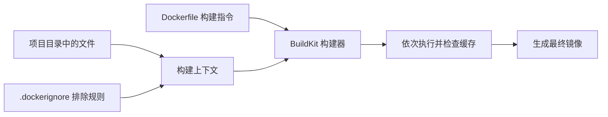
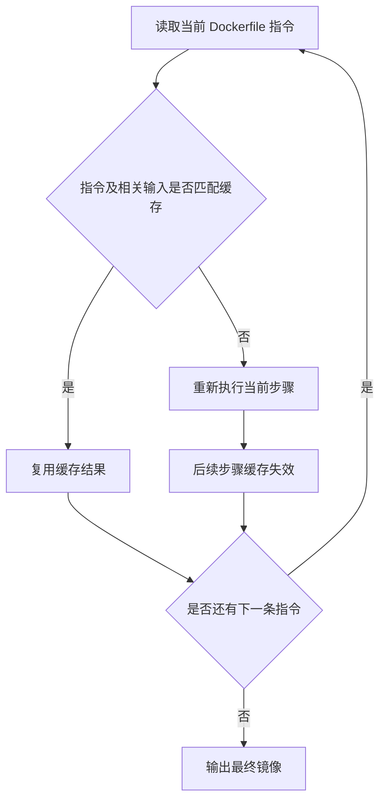
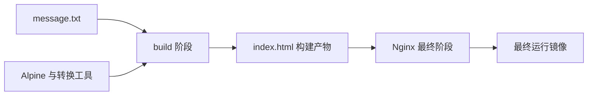

# 02 Dockerfile 与镜像构建

这是 Docker 学习的第二阶段：把项目文件和运行要求写成 Dockerfile，再由 Docker 构建为可重复使用的镜像。

> [!info] 实际验证
> 2026-09-30 已在 Docker Desktop 4.93.0 / Engine 29.8.1 上完成两阶段构建和 HTTP 验证；连续构建时 `WORKDIR`、`COPY`、`RUN` 与 `COPY --from` 均显示缓存命中。

## 一句话结论

Dockerfile 描述“镜像应当怎样生成”，BuildKit 按顺序处理指令并复用可用缓存；把稳定步骤放前面、易变文件放后面，可以在不改变结果的前提下显著减少重复构建。

## 1. 从项目目录到镜像

> [!note] 新名词
> **Dockerfile**：一个文本文件，用一组有顺序的指令描述镜像的基础内容、项目文件、构建动作和默认启动方式。它本身不是镜像，也不会直接运行应用。
>
> **构建（Build）**：Docker 读取 Dockerfile 和所需项目文件、执行指令并生成镜像的过程。运行容器发生在构建完成之后，是另一个阶段。

下面的图说明构建时各对象如何汇合。左侧是输入，中间是构建器，右侧是输出；箭头表示输入被读取或结果被传递。



流程由 `docker build` 触发。Dockerfile 告诉 BuildKit 要做什么，构建上下文提供 `COPY` 等指令允许读取的文件，`.dockerignore` 在文件交给构建器前排除无关内容。BuildKit 按依赖顺序处理指令：能够匹配已有缓存的步骤直接复用，否则重新执行。全部步骤成功后输出一个本地镜像；任一步骤失败都不会得到本次期望的最终镜像。

> [!note] 新名词：BuildKit
> BuildKit 是当前 Docker 使用的镜像构建后端，负责解析 Dockerfile、安排构建步骤、计算缓存并输出镜像。它不是 Docker Daemon 的别名，也不负责长期运行容器。

## 2. 用一个最小项目认识 Dockerfile

本库提供了可复制的实验目录：`code/docker-learning-labs/02-image-and-storage/`。其中的 Dockerfile 内容如下：

```dockerfile
# syntax=docker/dockerfile:1

FROM alpine:3.23 AS build
WORKDIR /src
COPY message.txt .
RUN mkdir -p /out \
    && tr '[:lower:]' '[:upper:]' < message.txt > /out/index.html

FROM nginx:1.31.6-alpine
COPY --from=build /out/index.html /usr/share/nginx/html/index.html
EXPOSE 80
```

> [!note] 新名词
> **基础镜像（Base Image）**：`FROM` 指定本阶段从哪个已有镜像开始。后续指令是在这份基础内容上增加变化，而不是从空目录凭空生成完整系统。
>
> **构建阶段（Build Stage）**：一个阶段从一条 `FROM` 开始，到下一条 `FROM` 或文件结束为止。阶段可以命名，供后面的 `COPY --from=阶段名` 引用。
>
> **Alpine Linux**：Alpine 是体积较小的 Linux 发行版，本例只把它用作生成网页的构建环境。最终运行环境是下一阶段的 Nginx 镜像。
>
> **语法指令（Syntax Directive）**：文件首行的 `# syntax=docker/dockerfile:1` 指定 Dockerfile 前端语法版本，使 BuildKit 能按相应规则解析文件。它不是普通的构建步骤，也不会生成镜像层。

代码中的 `tr` 是 Alpine 提供的普通文本转换命令，这里只负责把小写字母转成大写；它不是 Dockerfile 指令。

各条指令按出现顺序理解：

| 指令 | 在本例中的作用 | 发生时间 |
| --- | --- | --- |
| `FROM alpine:3.23 AS build` | 开始名为 `build` 的构建阶段 | 构建时 |
| `WORKDIR /src` | 把后续命令的工作目录设为 `/src` | 构建时 |
| `COPY message.txt .` | 从构建上下文复制文件到当前阶段 | 构建时 |
| `RUN ...` | 启动临时构建环境执行命令，并保存文件变化 | 构建时 |
| 第二个 `FROM` | 开始最终运行阶段 | 构建时 |
| `COPY --from=build ...` | 只把前一阶段的结果复制进最终镜像 | 构建时 |
| `EXPOSE 80` | 记录应用预期监听 80 端口，不会自动发布宿主机端口 | 镜像元数据 |

如果终端当前位于知识库根目录，先进入实验目录，再执行构建：

```bash
cd code/docker-learning-labs/02-image-and-storage
docker build --tag harlan/docker-build-demo:1.0 .
```

这条命令应拆成三部分理解：
- `docker build`：开始构建镜像。
- `--tag harlan/docker-build-demo:1.0`：把镜像命名为 `harlan/docker-build-demo`，标签设为 `1.0`。
- 最后的 `.`：一个独立的路径参数，表示“使用当前目录作为构建上下文”；它不属于 `1.0`。Docker 默认从这个目录读取 `Dockerfile`，并让 `COPY` 等指令访问其中未被 `.dockerignore` 排除的文件。

构建成功后继续在这个目录运行：

```bash
docker run --name docker-build-demo \
  --detach \
  --publish 127.0.0.1:8080:80 \
  harlan/docker-build-demo:1.0
```

行末的 `\` 表示“下一行仍属于同一条命令”，只是为了排版易读；它必须放在行尾，而不是写成 `\--detach`。

| 命令部分 | 作用 |
| --- | --- |
| `docker run` | 根据镜像创建一个新容器，并立即启动它；可以理解为 `docker create` 加 `docker start` |
| `--name docker-build-demo` | 把容器命名为 `docker-build-demo`，后续可直接用这个名字执行 `docker logs`、`docker stop` 等命令 |
| `--detach` | 让容器在后台运行；命令执行成功后终端会输出容器 ID，然后立即返回提示符 |
| `--publish 127.0.0.1:8080:80` | 把 Mac 的 `127.0.0.1:8080` 转发到容器的 80 端口 |
| `harlan/docker-build-demo:1.0` | 指定用刚刚构建的 `1.0` 标签镜像创建容器 |

> [!note] 新名词
> **后台运行（Detached Mode）**：容器继续运行，但不占住当前终端。关闭这个终端通常不会停止容器。
>
> **端口发布（Port Publishing）**：把宿主机上的地址和端口映射到容器端口，使宿主机能够访问容器内服务。这里的访问方向是 `Mac 的 127.0.0.1:8080 → 容器的 80`。

这里绑定的是 `127.0.0.1`，因此默认只有这台 Mac 自己能够访问该端口。命令没有使用 `--rm`，所以停止容器后容器记录仍会保留，需要再执行 `docker rm docker-build-demo` 才会删除。

运行后可以检查容器并访问网页：

```bash
docker ps --filter name=docker-build-demo

curl http://127.0.0.1:8080
```

`docker ps` 应显示该容器处于 `Up` 状态；`curl` 的预期响应是大写的 `HELLO FROM HARLAN'S DOCKER BUILD LAB.`。Dockerfile 中的 `EXPOSE 80` 只记录端口信息，本身不会完成端口发布。

结束后只清理本实验容器：

```bash
docker stop docker-build-demo
docker image ls
docker rm docker-build-demo
docker image ls
```

![[Pasted image 20261002215052.png]]
停止容器后第一次查看镜像时，`harlan/docker-build-demo:1.0` 的 `EXTRA` 列仍可能显示 `U`，因为停止的容器依然存在并引用该镜像。执行 `docker rm docker-build-demo` 后，容器引用消失，所以第二次查看时 `U` 消失；但镜像本身仍会保留。

这是两个不同的删除动作：

| 命令 | 删除对象 | 镜像是否保留 |
| --- | --- | --- |
| `docker rm docker-build-demo` | 容器 | 保留 |
| `docker image rm harlan/docker-build-demo:1.0` | 镜像的本地标签及其不再被引用的内容 | 不再显示该镜像标签 |

因此只有明确不再需要这个实验镜像时，才继续执行：

```bash
docker image rm harlan/docker-build-demo:1.0
```

如果还有其他容器引用该镜像，Docker 会拒绝正常删除并提示冲突；先用 `docker ps -a` 查清容器，不要直接使用 `--force`。删除自定义镜像也不会自动删除它使用的 `alpine:3.23` 或 `nginx:1.31.6-alpine` 基础镜像，因为这些是独立的本地镜像，也可能被其他镜像复用。

## 3. 先学会 `docker build` 与 `docker run`

`docker build` 和 `docker run` 都是在终端执行的 Docker CLI 命令：前者把项目构建成镜像，后者根据镜像创建并启动容器。它们不是 Dockerfile 里的 `RUN`、`CMD` 或 `ENTRYPOINT` 指令。

| 写在哪里 | 示例 | 作用 |
| --- | --- | --- |
| 终端 | `docker build ...` | 构建镜像 |
| 终端 | `docker run ...` | 创建并启动容器 |
| Dockerfile | `RUN apk add ...` | 构建镜像期间执行命令 |
| Dockerfile | `CMD [...]`、`ENTRYPOINT [...]` | 设置容器启动时的默认程序和参数 |

### 3.1 先看懂命令语法

> [!note] 新名词
> **选项（Option）**：以 `-` 或 `--` 开头，用来改变命令行为，例如 `--detach`。有些选项后面还需要一个值，例如 `--name web`。
>
> **位置参数（Positional Argument）**：含义由它在命令中的位置决定，不以 `-` 开头。例如 `docker build` 末尾的 `.` 是构建上下文，`docker run` 中的镜像名也是位置参数。

阅读官方命令语法时：

- `[内容]` 表示可选部分，不需要输入方括号。
- `A | B` 表示在多个形式中选择一个。
- 大写单词如 `IMAGE`、`COMMAND` 是占位符，需要换成真实值。
- 完整选项随 Docker 版本变化，随时可以用 `docker build --help` 或 `docker run --help` 查看本机版本支持的全部参数。

### 3.2 `docker build`：从文件构建镜像

基本语法：

```text
docker build [OPTIONS] PATH | URL | -
```

当前 Docker Desktop 中，`docker build` 是 `docker buildx build` 的别名并使用 BuildKit。初学阶段继续使用较简洁的 `docker build` 即可。

| 常用参数 | 作用 | 示例 |
| --- | --- | --- |
| `-t, --tag` | 给构建结果设置镜像名和标签 | `--tag example/app:1.0` |
| `-f, --file` | 指定非默认名称或位置的 Dockerfile | `--file Dockerfile.dev` |
| `--build-arg` | 给 Dockerfile 中的 `ARG` 传值 | `--build-arg APP_VERSION=1.0` |
| `--target` | 只构建到指定的多阶段构建阶段 | `--target build` |
| `--no-cache` | 本次构建不复用已有构建缓存 | `--no-cache` |
| `--pull` | 构建前尝试拉取较新的基础镜像 | `--pull` |
| `--platform` | 指定目标平台 | `--platform linux/arm64` |
| `--progress=plain` | 使用普通文本显示更完整的构建日志 | `--progress=plain` |

最常用形式是：

```bash
docker build --tag harlan/docker-build-demo:1.0 .
```

参数解析顺序如下：先识别 `--tag` 选项及其值，再把最后的 `.` 识别为构建上下文。Docker 默认读取 `./Dockerfile`；如果文件名不同，可以写：

```bash
docker build \
  --file Dockerfile.dev \
  --tag harlan/docker-build-demo:dev \
  .
```

不要把密码或 Token 直接放进 `--build-arg`；需要敏感输入时使用后文提到的 BuildKit secret。

> [!note] 新名词
> **镜像引用（Image Reference）**：镜像的完整称呼，常见格式是 `[Registry地址/][命名空间/]仓库名[:标签]`。本例的完整镜像引用是 `harlan/docker-build-demo:1.0`。
>
> **命名空间（Namespace）**：`harlan`，通常用于表示 Docker Hub 用户名或组织名；这里只是本地命名的一部分，不代表镜像已经上传，也不验证该账号是否存在。
>
> **仓库名（Repository）**：`docker-build-demo`，表示这组镜像的项目名称。`harlan/docker-build-demo` 合起来通常称为镜像名或仓库路径。
>
> **标签（Tag）**：冒号后面的 `1.0`，用于区分同一仓库下的不同版本或变体。只有 `1.0` 是标签，不是 `docker-build-demo:1.0` 整段。

`--tag`（短写 `-t`）给构建结果设置镜像引用。这里的镜像只保存在本地，不会因为名称中有 `harlan` 就自动上传到 Registry。

### 3.3 `docker run`：从镜像创建并启动容器

基本语法：

```text
docker run [OPTIONS] IMAGE[:TAG|@DIGEST] [COMMAND] [ARG...]
```

这个顺序非常重要：Docker 自己的选项必须写在镜像名前面；镜像名后面的内容会被当成容器内要执行的命令和参数，而不是 `docker run` 的选项。

| 常用参数 | 作用 | 示例 |
| --- | --- | --- |
| `--name` | 给容器设置易读名称 | `--name web` |
| `-d, --detach` | 在后台运行容器 | `--detach` |
| `-p, --publish` | 把宿主机端口发布到容器端口 | `--publish 127.0.0.1:8080:80` |
| `--rm` | 容器退出后自动删除容器 | `--rm` |
| `-e, --env` | 设置或覆盖一个环境变量 | `--env APP_ENV=dev` |
| `--env-file` | 从文件读取多项环境变量 | `--env-file .env` |
| `--mount` | 挂载 Volume 或宿主机目录 | `--mount type=volume,src=data,dst=/data` |
| `--network` | 把容器连接到指定网络 | `--network app-net` |
| `-i, --interactive` | 保持标准输入打开 | `-i` |
| `-t, --tty` | 分配一个交互终端，通常与 `-i` 合写为 `-it` | `-it` |
| `--entrypoint` | 覆盖镜像设置的默认入口程序 | `--entrypoint sh` |
| `-w, --workdir` | 覆盖容器内的工作目录 | `--workdir /app` |
| `-u, --user` | 指定容器进程使用的用户或 UID | `--user 1000:1000` |
| `--memory`、`--cpus` | 限制容器可用内存和 CPU | `--memory 512m --cpus 0.5` |

三个最容易理解后续内容的例子：

```bash
# 运行 echo hello；进程结束后自动删除容器
docker run --rm alpine:3.23 echo hello

# 打开交互式 Shell；输入 exit 后退出并删除容器
docker run --rm -it alpine:3.23 sh

# 后台运行 Web 服务，并发布端口
docker run --name docker-build-demo \
  --detach \
  --publish 127.0.0.1:8080:80 \
  harlan/docker-build-demo:1.0
```

第一条命令中，`alpine:3.23` 是镜像，后面的 `echo hello` 是容器内执行的命令和参数。第三条没有在镜像名后追加命令，因此使用镜像自身设置的默认启动程序。


## 4. `RUN`、`CMD` 与 `ENTRYPOINT`

> [!note] 新名词：Dockerfile 指令
> `RUN`、`CMD`、`ENTRYPOINT` 等大写单词是 Dockerfile 指令。它们看起来都能写命令，但执行阶段和覆盖规则不同。

| 指令 | 何时执行 | 主要用途 | 能否被 `docker run IMAGE ...` 改变 |
| --- | --- | --- | --- |
| `RUN` | 构建镜像时 | 安装依赖、编译或生成文件 | 不适用；容器启动时不会重跑 |
| `CMD` | 容器启动时 | 提供默认命令或默认参数 | 会被镜像名后的命令或参数覆盖 |
| `ENTRYPOINT` | 容器启动时 | 指定镜像的主要可执行程序 | Exec form 下通常保留，运行参数追加在后面 |

如果镜像表达“这是一个固定程序，可接收不同参数”，常见组合是：

```dockerfile
ENTRYPOINT ["python", "-m", "http.server"]
CMD ["8000", "--directory", "/app"]
```

这两行在构建镜像时**不会启动 Python 服务**，而是把容器将来的默认启动方式记录进镜像。可以先记住下面这个组合规则：

```text
容器最终执行的命令 = ENTRYPOINT + CMD 默认参数
                      或
                      ENTRYPOINT + 镜像名后传入的新参数
```

第一行规定固定程序：

| 数组元素 | 交给程序的含义 |
| --- | --- |
| `python` | 启动 Python 解释器 |
| `-m` | 告诉 Python：按名称运行后面的 Python 模块 |
| `http.server` | Python 自带的简单 HTTP 服务器模块 |

第二行提供这项程序的默认参数：

| 数组元素 | 交给 `http.server` 的含义 |
| --- | --- |
| `8000` | 让服务器监听容器内的 `8000` 端口 |
| `--directory` | 指定要对外提供文件的目录；它后面必须跟一个目录路径 |
| `/app` | 作为 `--directory` 的值，表示提供 `/app` 中的文件 |

因此，不在镜像名后面添加参数时：

```bash
docker run IMAGE
```

这里的 `IMAGE` 是镜像引用的占位符，实际使用时要换成真正的镜像名。Docker 会采用 `CMD` 的默认参数，最终相当于直接执行：

```bash
python -m http.server 8000 --directory /app
```

也可以把 Docker 实际交给操作系统的内容看成下面这个参数数组；数组中的每一项都是一个独立参数：

```text
["python", "-m", "http.server", "8000", "--directory", "/app"]
```

如果运行时在镜像名后面给出新参数：

```bash
docker run IMAGE 9000 --directory /app
```

`IMAGE` 后面的 `9000 --directory /app` 会**整组替换**原来的 `CMD ["8000", "--directory", "/app"]`，但不会替换 `ENTRYPOINT`。最终执行的是：

```bash
python -m http.server 9000 --directory /app
```

也就是说，这次只是把监听端口从 `8000` 改成了 `9000`。这里不是只把 `8000` 单独替换掉，而是先丢弃整组默认参数，再使用你新传入的整组参数。例如只写 `docker run IMAGE 9000` 时，`--directory /app` 也会一起消失，服务器会改为提供容器当前工作目录中的文件。

这里的 `9000` 是**容器内部**的监听端口，并不会自动开放给 Mac。需要从 Mac 浏览器访问时，还要在镜像名之前添加端口发布参数：

```bash
docker run --rm \
  --publish 127.0.0.1:9000:9000 \
  IMAGE 9000 --directory /app
```

这条命令中，前一个 `9000` 是 Mac 上访问的端口，后一个 `9000` 是容器端口；镜像名后面的 `9000` 则是传给 Python 的监听端口参数。虽然它们恰好都写成 `9000`，但属于三个不同位置。

> [!note] 新名词：Exec form 与 Shell form
> **模块（Module）**：可以被 Python 加载或运行的一组代码。`python -m http.server` 表示让 Python 运行名为 `http.server` 的内置模块。
>
> **Exec form**：使用 JSON 数组书写，例如 `ENTRYPOINT ["python", "-m", "http.server"]`。Docker 直接启动数组第一项，并把后续各项逐个作为参数传给它，不会先启动命令 Shell。
>
> **Shell form**：使用普通命令字符串书写，例如 `ENTRYPOINT python -m http.server`。Linux 容器通常会先运行 `/bin/sh -c`，再由 Shell 解释这段字符串。它适合需要变量展开、管道或 `&&` 的命令，但主进程和停止信号的处理更容易出问题。

本例的 `ENTRYPOINT` 和 `CMD` 都使用 Exec form，所以二者可以按参数数组直接拼接，Python 也会直接成为容器的主进程。除非明确需要 Shell 功能，否则启动长期运行的服务时优先使用这种形式。

## 5. `ARG` 与 `ENV`

> [!note] 新名词
> **构建参数（Build Argument）**：`ARG` 定义构建期间可传入的变量，例如选择依赖版本。它不会像 `ENV` 那样自动保留为最终容器的环境变量。
>
> **环境变量（Environment Variable）**：`ENV` 把键值写进镜像配置，基于该镜像启动的容器默认可以读取。运行时仍可使用 `docker run --env` 覆盖它。

```dockerfile
ARG APP_VERSION=dev
ENV APP_VERSION=$APP_VERSION
```

```bash
docker build \
  --build-arg APP_VERSION=1.0.0 \
  --tag example/app:1.0.0 .
```

这里 `ARG` 接收构建输入，`ENV` 明确把结果保留到镜像配置。不要把密码、Token 或私钥放进 `ARG`、`ENV`、`RUN` 参数或被复制的文件；这些值可能出现在镜像配置、历史记录、缓存或构建证明中。

> [!note] 新名词：构建秘密（Build Secret）
> 构建秘密是只在某个构建步骤临时提供、不会主动写入最终镜像的敏感输入机制。等需要下载私有依赖时，再单独学习 BuildKit secret mount。

## 6. 构建上下文与 `.dockerignore`

> [!note] 新名词
> **构建上下文（Build Context）**：本次构建允许访问的一组文件。`docker build ... .` 中的 `.` 表示当前目录；`COPY` 不能任意读取这个范围之外的宿主机文件。
>
> **`.dockerignore`**：构建上下文的排除清单。匹配的文件在上下文交给构建器前被移除，既减少传输量，也避免把本地缓存、Git 目录或秘密文件误送入构建。

本实验使用：

```text
.git
.DS_Store
bind-content
README.md
```

`.dockerignore` 与 `.gitignore` 的用途不同：前者决定 Docker 构建能看到什么，后者决定 Git 跟踪什么。即使某个文件已被 Git 忽略，只要没有被 `.dockerignore` 排除，它仍可能进入 Docker 构建上下文。

## 7. 构建缓存为什么会命中或失效

> [!note] 新名词
> **构建缓存（Build Cache）**：保存先前构建步骤的可复用结果。输入和指令没有变化时，BuildKit 可以跳过实际执行，直接使用已有结果。
>
> **缓存失效（Cache Invalidation）**：某一步的指令或相关输入不再匹配旧结果。由于后续步骤依赖它们之前的状态，后续缓存也必须重新计算。

下面的图从一条 Dockerfile 指令开始，展示缓存判定和向后传播。菱形是判断，`下一条指令` 会重复同一过程，直到所有指令处理完成。



BuildKit 首先检查当前指令及其依赖输入。完全匹配时走“复用”分支；例如相同的 `RUN` 文本以及相同的上一步结果可以继续使用旧缓存。`COPY` 的源文件内容或相关元数据改变、Dockerfile 中的命令改变，都会走“重新执行”分支。某一步重新执行后，位于它之后的步骤也需要重新处理；所有指令处理完成才输出最终镜像。

因此依赖文件通常先复制，频繁变化的源码后复制。例如：

```dockerfile
COPY package.json package-lock.json ./
RUN npm ci
COPY . .
```

只改业务源码时，前两步仍有机会复用；如果一开始就 `COPY . .`，任何源码变化都可能让昂贵的依赖安装重新执行。还要注意：仅仅过了一段时间，不会自动让普通 `RUN apk add ...` 或 `RUN apt-get ...` 缓存失效；需要获取更新内容时必须采用明确的重建和版本更新策略。

## 8. BuildKit 与多阶段构建

> [!note] 新名词
> **多阶段构建（Multi-stage Build）**：一个 Dockerfile 包含多个 `FROM` 时，每个 `FROM` 开始一个独立构建阶段。最终镜像只需要复制运行所需结果，不必携带编译器和中间文件。
>
> **构建产物（Build Artifact）**：编译、打包或转换后准备交付的文件，例如二进制程序、JAR 或静态网页。它与源码、编译器和下载缓存不是同一个东西。

本例的 `build` 阶段使用 Alpine 和 `tr` 生成 `index.html`；最终阶段只从 `build` 复制这一份结果，再继承 Nginx 官方镜像的启动配置。BuildKit 可以跳过与目标阶段无依赖关系的阶段，并对独立步骤进行更高效的调度。



流程由第一个 `FROM` 进入 `build` 阶段，工具读取源码并生成 `index.html`。`COPY --from=build` 是两个阶段之间唯一需要的传递箭头；Alpine 阶段中的其他文件不会自动进入最终镜像。第二个阶段把产物放进 Nginx 的网页目录，最后输出可运行镜像。关键结论是：构建工具留在构建阶段，最终镜像只保存运行所需内容。

## 9. `COPY` 与 Bind Mount 不要混淆

> [!note] 新名词：Bind Mount（绑定挂载）
> Bind Mount 在容器运行时把宿主机现有路径连接到容器路径。它不修改镜像；宿主机文件变化通常会立即反映到挂载位置。

| 对比 | `COPY` | Bind Mount |
| --- | --- | --- |
| 发生时间 | 构建镜像时 | 运行容器时 |
| 数据来源 | 构建上下文 | Docker Daemon 所在主机的路径 |
| 是否进入镜像 | 是 | 否 |
| 常见用途 | 把应用和固定配置打包进镜像 | 开发时共享源码或注入宿主机配置 |
| 可移植性 | 镜像带着文件走 | 依赖目标主机存在相应路径 |

数据持久化和挂载命令继续见 [[03-Docker数据存储]]。

## 10. 来源

- [Dockerfile overview](https://docs.docker.com/build/concepts/dockerfile/) — 常用指令、构建与运行入口。
- [Dockerfile reference](https://docs.docker.com/reference/dockerfile/) — `RUN`、`CMD`、`ENTRYPOINT`、`ARG`、`ENV` 的精确语义。
- [docker buildx build](https://docs.docker.com/reference/cli/docker/buildx/build/) — `docker build` 的完整语法、参数和 BuildKit 行为；访问日期 2026-10-02。
- [docker container run](https://docs.docker.com/reference/cli/docker/container/run/) — `docker run` 参数、后台运行、端口、挂载和交互选项；访问日期 2026-10-02。
- [Running containers](https://docs.docker.com/engine/containers/run/) — `[COMMAND] [ARG...]` 与 `CMD`、`ENTRYPOINT` 的覆盖关系；访问日期 2026-10-02。
- [Build context](https://docs.docker.com/build/concepts/context/) — 构建上下文和 `.dockerignore`。
- [Docker build cache](https://docs.docker.com/build/cache/) — 缓存工作方式与失效传播。
- [BuildKit](https://docs.docker.com/build/buildkit/) — 当前构建后端及能力。
- [Multi-stage builds](https://docs.docker.com/build/building/multi-stage/) — 多个构建阶段与 `COPY --from`。
- [docker container rm](https://docs.docker.com/reference/cli/docker/container/rm/) — `docker rm` 删除容器的范围；访问日期 2026-10-02。
- [docker image rm](https://docs.docker.com/reference/cli/docker/image/rm/) — 镜像删除、取消标签和容器引用限制；访问日期 2026-10-02。
- [Docker CLI #5560](https://github.com/docker/cli/issues/5560) — Docker CLI 新版镜像列表的磁盘、内容大小与使用状态列设计；访问日期 2026-10-02。
- [nginx Docker Official Image](https://hub.docker.com/_/nginx) — 实验所用基础镜像及当前支持标签；访问日期 2026-09-30。

## 相关

- [[Docker镜像构建]] — 规范化的构建原理
- [[Docker镜像与容器]] — 镜像层、Tag 与 Digest
- [[Docker镜像构建与挂载实验]] — 从构建到挂载的完整命令
- [[03-Docker数据存储]] — Volume、Bind Mount 与 `COPY` 的边界
- [[Docker学习路径]] — 四周学习顺序
