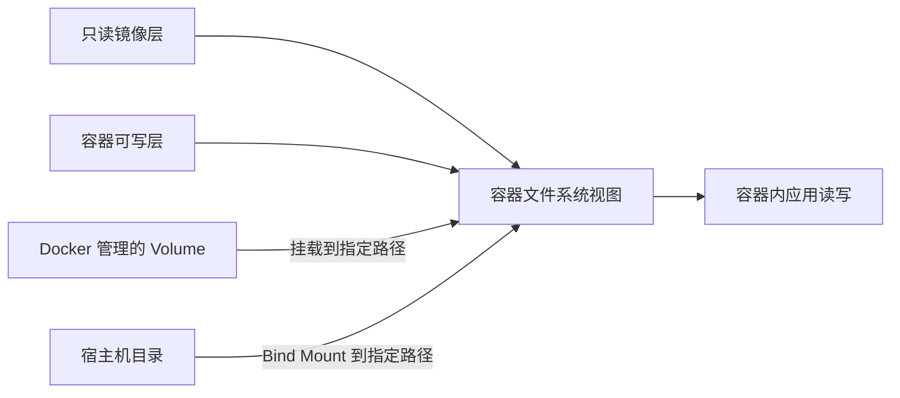

# 03 Docker 数据存储

这是 Docker 学习的第三阶段：分清容器可写层、Volume 与 Bind Mount，知道数据究竟保存在哪里、何时会消失。

> [!info] 实际验证
> 2026-09-30 已用两个一次性容器验证命名 Volume 数据可复用，并验证 readonly Bind Mount 能被 Nginx 读取；实验 Volume 和临时容器随后均已精确清理。

## 一句话结论

容器可写层跟随容器删除；Volume 由 Docker 管理并独立于单个容器；Bind Mount 直接使用宿主机路径。长期业务数据优先放 Volume，需要宿主机直接编辑的开发文件使用 Bind Mount。

## 1. 为什么需要容器外部存储

容器根据只读镜像创建后，会得到自己的可写层。直接写进容器文件系统的新文件通常进入该层；删除容器时，这些数据会与容器层一起被删除。

> [!note] 新名词
> **数据持久化（Persistence）**：数据寿命不依赖某一次进程或容器运行。容器删除并重新创建后，数据仍能被新的容器重新挂载和读取。
>
> **挂载（Mount）**：把某个外部存储位置接到容器目录树中的指定路径。容器仍按普通文件路径读写，但数据实际保存位置由挂载类型决定。

## 2. 三种数据位置

> [!note] 新名词
> **Volume（数据卷）**：由 Docker 创建和管理的持久存储。它不属于某个容器；删除使用它的容器后，Volume 默认仍然存在。
>
> **Bind Mount（绑定挂载）**：把宿主机已有文件或目录直接连接到容器路径。宿主机和容器看到的是同一份文件，因此双方修改可能相互影响。

下面的图比较三条数据路径。箭头指向容器看到的目录位置；同一个容器路径一次只能由实际生效的文件系统或挂载提供内容。



容器启动时先由只读镜像层和本容器可写层组成默认文件系统视图。如果指定 Volume 或 Bind Mount，它们会接入目标路径；应用仍然通过容器内路径读写。写入普通路径时数据进入容器可写层，写入 Volume 路径时进入 Docker 管理的存储，写入 Bind Mount 路径时直接改变宿主机文件。容器删除后，第一条写入路径随容器消失，后两种外部数据仍可存在。

| 位置 | 谁管理 | 删除容器后 | 宿主机是否适合直接编辑 | 主要用途 |
| --- | --- | --- | --- | --- |
| 容器可写层 | Docker，绑定单个容器 | 删除 | 不适合 | 临时运行状态 |
| Volume | Docker | 默认保留 | 不建议直接操作内部目录 | 数据库数据、应用持久数据 |
| Bind Mount | 用户和宿主机文件系统 | 保留 | 适合 | 开发源码、配置、生成文件 |

## 3. 用命名 Volume 验证数据独立于容器

> [!note] 新名词：命名 Volume（Named Volume）
> 命名 Volume 是带有明确名称的数据卷，例如 `docker-learning-data`。明确命名后更容易检查、复用和精确清理。

先创建 Volume：

```bash
docker volume create docker-learning-data
```

启动一个一次性容器写入文件。容器退出后因 `--rm` 被删除，但 Volume 不会自动删除：

```bash
docker run --rm \
  --mount type=volume,src=docker-learning-data,dst=/data \
  alpine:3.23 \
  sh -c 'printf "saved in volume\n" > /data/message.txt'
```

> [!note] 新名词：`--mount`
> `--mount` 用显式键值描述挂载类型、来源和容器目标路径。相比 `-v`，它更容易读清楚，也会在 Bind Mount 源路径不存在时直接报错。

再启动一个全新的容器读取同一个 Volume：

```bash
docker run --rm \
  --mount type=volume,src=docker-learning-data,dst=/data \
  alpine:3.23 \
  cat /data/message.txt
```

预期输出是 `saved in volume`。写入容器和读取容器都已自动删除，数据仍存在，说明数据属于 Volume 而不是那两个容器。

查看 Volume：

```bash
docker volume inspect docker-learning-data
```

完成实验后，仅删除这个明确命名的 Volume：

```bash
docker volume rm docker-learning-data
```

删除 Volume 会永久删除其中的数据。命令失败并提示仍在使用时，应先找出并停止使用该 Volume 的容器，不要改用全局 `docker volume prune`。

## 4. 用 Bind Mount 把宿主机网页交给 Nginx

在 `code/docker-learning-labs/02-image-and-storage/` 目录执行：

```bash
mkdir -p bind-content
printf '<h1>Hello from Bind Mount</h1>\n' > bind-content/index.html

docker run --name docker-bind-demo \
  --rm \
  --detach \
  --publish 127.0.0.1:8081:80 \
  --mount type=bind,src="$(pwd)/bind-content",dst=/usr/share/nginx/html,readonly \
  nginx:1.31.6-alpine

curl http://127.0.0.1:8081
```

> [!note] 新名词：只读挂载（Read-only Mount）
> `readonly` 允许容器读取挂载内容，但阻止它通过该挂载修改宿主机文件。它适合只需读取的网页、证书或配置文件。

此时 Nginx 读取的是 Mac 上 `bind-content/index.html`。修改这个文件后再次请求，通常会直接看到新内容，不需要重新构建镜像。Docker Desktop 会负责把 Mac 路径共享给其 Linux VM 中的容器。

结束容器：

```bash
docker stop docker-bind-demo
```

因为运行时使用了 `--rm`，停止后容器会自动删除；宿主机的 `bind-content/` 不会删除。

## 5. 挂载为什么会遮住镜像原文件

如果镜像中的 `/app/config` 已经有文件，再把 Volume 或 Bind Mount 挂到同一路径，容器会先看到挂载内容，原有镜像文件暂时被遮住。它类似于在已有目录上挂载外部磁盘：底层文件没有被删除，只是在挂载有效期间不可见。

这也是开发中常见的现象：镜像明明 `COPY` 了文件，运行后却“消失”，通常应检查是否有挂载覆盖同一路径。对于空 Volume，Docker 默认可能把容器目标目录原有内容复制进新 Volume；Bind Mount 则直接展示宿主机源路径内容，不会自动把镜像文件复制回宿主机目录。

## 6. `COPY`、Volume 与 Bind Mount 怎么选

| 需求 | 选择 | 原因 |
| --- | --- | --- |
| 应用代码随镜像一起交付 | `COPY` | 构建时进入镜像，换主机仍然存在 |
| 数据库等由容器生成的长期数据 | Volume | 生命周期独立于容器，由 Docker 管理 |
| 开发时立即看到本地源码变化 | Bind Mount | 宿主机和容器共享同一文件 |
| 给容器注入只读本地配置 | Bind Mount + `readonly` | 不重建镜像即可更换配置，同时限制容器写入 |
| 只在本次容器中存在的临时文件 | 容器可写层 | 不需要额外持久化对象 |

关键边界是：`COPY` 发生在构建时并改变镜像；Volume 与 Bind Mount 发生在运行时，不会修改镜像。不要为了把数据库数据“保存下来”而对运行中容器执行 `docker commit`，应该从一开始就把数据目录挂载到 Volume。

## 7. 来源

- [Docker storage](https://docs.docker.com/engine/storage/) — 容器可写层和挂载类型总览。
- [Volumes](https://docs.docker.com/engine/storage/volumes/) — Volume 生命周期、用途和挂载行为。
- [Bind mounts](https://docs.docker.com/engine/storage/bind-mounts/) — Bind Mount 语义、`--mount` 语法和 Docker Desktop 路径共享。
- [Dockerfile overview](https://docs.docker.com/build/concepts/dockerfile/) — `COPY` 的构建期行为。

## 相关

- [[Docker数据持久化]] — 存储类型和生命周期的规范说明
- [[Docker镜像与容器]] — 容器可写层和 Copy-on-Write
- [[Docker镜像构建与挂载实验]] — 完整运行与清理步骤
- [[02-Dockerfile与镜像构建]] — `COPY`、构建上下文和镜像生成
- [[Docker学习路径]] — 第二阶段在四周计划中的位置
