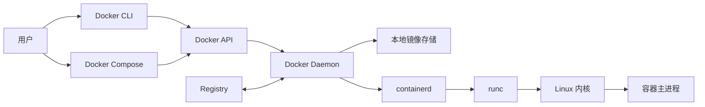
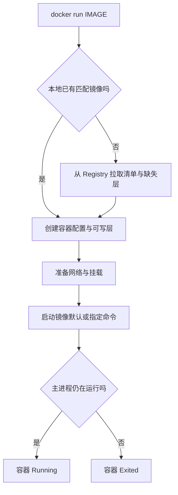
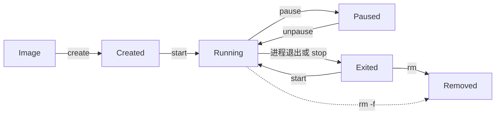

# Docker 核心学习笔记

这是 Docker 四周学习专题的第一阶段。Mac 用户先完成下面的安装与验证，再学习容器、镜像和生命周期；这些概念是后续 Dockerfile、存储、网络和 Compose 的基础。

## 0. 先在 Mac 上安装 Docker

本节使用 Homebrew 安装 Docker Desktop。Docker Desktop 已包含 Docker CLI、Docker Engine 和 Docker Compose，不需要分别安装这些组件。

### 0.1 使用 Homebrew 安装

先确认终端能使用 Homebrew：

```bash
brew --version
```

如果命令能显示版本，执行：

```bash
brew install --cask docker
```

`--cask` 表示安装 macOS 桌面应用。这里必须安装 Docker Desktop cask；`brew install docker` 安装的只是 Docker CLI，没有负责运行容器的本地 Engine。

日后可以使用以下命令更新 Docker Desktop：

```bash
brew upgrade --cask docker
```

Homebrew 当前安装命令见 [docker cask](https://formulae.brew.sh/cask/docker)，Docker Desktop 的首次启动流程见 [官方 Mac 安装说明](https://docs.docker.com/desktop/setup/install/mac-install/)。如果 Mac 还没有 Homebrew，先按照 [Homebrew 官方安装说明](https://docs.brew.sh/Installation)完成安装，再回到这里。

### 0.2 验证 Docker 环境

打开一个新的终端窗口，在任意目录依次执行：

```bash
docker --version
docker version
docker compose version
```

| 命令 | 验证什么 | 成功标准 |
| --- | --- | --- |
| `docker --version` | 终端是否能找到 Docker CLI | 显示 Docker 客户端版本 |
| `docker version` | 客户端是否能连接容器引擎 | 同时显示 **Client** 与 **Server** 部分 |
| `docker compose version` | Compose 插件是否可用 | 显示 Compose 版本 |

版本号以实际安装结果为准，不必与笔记中的发行说明完全相同。尤其要检查 `docker version`：只有 Client、没有 Server，说明还没有完成引擎连接验证。

#### 每次使用 Docker 都要打开 Docker Desktop 吗

在 Mac 上使用 Docker Desktop 提供的本地 Engine 时，**Docker Desktop 必须处于运行状态**，但不需要一直打开 Dashboard 窗口，也不需要在每条 `docker` 命令之前重复启动它。

可以这样理解：

- Docker CLI 是遥控器，Docker Desktop 中的 Engine 是实际工作的机器；只有遥控器、没有运行中的 Engine，无法创建或管理本地容器。
- 关闭终端不会停止以 `-d` 方式运行的容器，因为容器由 Engine 管理。
- 关闭 Docker Desktop 的 Dashboard 窗口通常不等于退出应用；菜单栏中的 Docker 图标仍显示 Engine 正在运行即可。
- 真正退出 Docker Desktop 会停止本地 Engine，后台容器也不能继续运行。再次启动 Desktop 后，容器是否自动启动取决于它的 restart policy；默认不会自动恢复运行。
- `docker run -d` 中的 `-d` 只表示容器与当前终端分离，不表示它能够脱离 Docker Engine 或 Docker Desktop 独立运行。

可以随时检查状态：

```bash
docker desktop status
docker version
```

需要时启动 Docker Desktop：

```bash
docker desktop start
```

也可以在“应用程序”中点击 Docker，或使用 `open -a Docker`。如果不想每次登录 Mac 后手动启动，可在 Docker Desktop 的 **Settings → General** 中开启 **Start Docker Desktop when you sign in to your computer**。Docker Desktop 默认的 Resource Saver 会在没有容器运行时减少资源占用，并在需要运行容器时自动唤醒，因此通常无需为了节省空闲资源而频繁退出应用。

参考：[Docker Desktop CLI](https://docs.docker.com/desktop/features/desktop-cli/)、[Docker Desktop 设置](https://docs.docker.com/desktop/settings-and-maintenance/settings/)和 [Resource Saver](https://docs.docker.com/desktop/use-desktop/resource-saver/)。

#### 关闭 Mac 前要先停止全部容器吗

不需要形成“每次关机都先停止全部容器，再退出 Docker Desktop”的固定动作。正常关闭 Mac 时可以让系统退出 Docker Desktop；但如果正在运行数据库、消息队列或会持续写数据的应用，推荐先按项目优雅停止，让进程有机会刷新数据和完成清理。

按下面三种情况处理：

- **没有运行中的容器**：可以直接正常关机。
- **一次性的无状态学习容器**：通常可以直接正常关机；若希望下次状态清晰，也可以先停止它。
- **数据库或 Compose 多服务项目**：先在项目目录执行 `docker compose stop`，确认停止后再正常关机。

推荐的关机前检查流程：

```bash
# 1. 查看当前有哪些容器正在运行
docker ps

# 2A. 停止一个明确命名的容器
docker stop web-demo

# 2B. 如果是 Compose 项目，在含 compose.yaml 的目录中停止整个项目
docker compose stop

# 3. 确认没有仍需处理的运行中容器
docker ps
```

`docker compose stop` 只停止项目容器，不删除它们，下次可以在相同目录使用 `docker compose start`。如果实验已经结束、希望同时删除项目容器和网络，则使用：

```bash
docker compose down
```

普通 `docker compose down` 默认不会删除命名 Volume；**不要随意添加 `-v`**，因为 `docker compose down -v` 会删除项目 Volume，其中的数据库数据可能永久丢失。

完成上述停止后，可以直接正常关闭 Mac；没有必要再把“手动退出 Docker Desktop”作为强制步骤。如果想完全确认 Desktop 已停止，也可以从菜单退出，但这只是可选操作。不要使用 `docker stop $(docker ps -q)` 作为日常关机流程，因为它会停止当前 Engine 中所有项目的容器；也不要执行 `docker system prune`，它属于资源清理而不是关机步骤。

官方行为说明：[docker stop](https://docs.docker.com/reference/cli/docker/container/stop/) 会先给进程优雅退出机会；[docker compose stop](https://docs.docker.com/reference/cli/docker/compose/stop/) 停止但保留容器；[docker compose down](https://docs.docker.com/reference/cli/docker/compose/down/) 会移除项目容器和网络，只有增加 `-v` 才会进一步删除 Volume。

### 0.3 运行第一个容器

保持 Docker Desktop 运行，在同一个终端执行：

```bash
docker run --rm hello-world:latest
```

这条命令首次执行时通常需要联网下载官方教学镜像。看到 **`Hello from Docker!`**，且命令正常结束，就完成了从客户端到引擎、镜像拉取和容器执行的基本验证。

1. 本地没有 `hello-world:latest` 时，Docker 先拉取镜像。
2. Docker 从镜像创建容器并启动容器主进程。
3. 主进程打印欢迎信息，然后正常退出。
4. 容器随主进程退出而停止；`--rm` 随即自动删除这个容器。

本次检查不开放服务端口，也不挂载 Mac 文件夹。镜像保留在本地，无需执行全局清理命令。更完整的观察与清理练习见 [[Docker环境验证与首个容器]]。

#### 查看当前有多少个容器

“当前开了多少个”可能指正在运行的容器，也可能指仍保留在 Docker 中的全部容器，需要分别查看：

```bash
# 列出正在运行的容器
docker ps

# 列出全部仍然存在的容器，包括已经停止的容器
docker ps -a

# 只统计正在运行的容器数量（macOS/Linux）
docker ps -q | wc -l

# 统计全部仍然存在的容器数量（macOS/Linux）
docker ps -aq | wc -l
```

`docker ps` 与 `docker container ls` 等价；`-q` 只输出容器 ID，便于计数。由于 `hello-world` 主进程很快退出，而且本次使用了 `--rm`，命令结束后它通常不会出现在 `docker ps` 或 `docker ps -a` 中。

#### 如何关闭一个容器

先用 `docker ps` 找到容器的名称或 ID，再执行 `docker stop`。下面用一个持续运行的 Nginx 容器演示完整过程：

```bash
# 创建并在后台启动名为 web-demo 的容器
docker run --name web-demo -d nginx:latest

# 确认它正在运行
docker ps

# 优雅停止它
docker stop web-demo

# 确认它已停止但仍然存在
docker ps -a
```

`docker stop web-demo` 只是结束容器进程，不会删除容器；以后可以用 `docker start web-demo` 再次启动。如果确定不再需要它，停止后再删除：

```bash
docker rm web-demo
```

正常关闭优先使用 `docker stop`，不要把 `docker kill` 或 `docker rm -f` 当作常规操作；后两者会跳过或缩短应用的正常退出过程。如果容器创建时使用了 `--rm`，那么它被停止或自然退出后会自动删除，无需再执行 `docker rm`。

### 0.4 Docker 常见命令

#### 查看环境

| 命令 | 作用 |
| --- | --- |
| `docker --version` | 查看 Docker CLI 版本 |
| `docker version` | 查看 Client 与 Server 版本，并验证两者能否连接 |
| `docker info` | 查看当前 Engine、存储驱动和资源概况 |
| `docker context show` | 查看 CLI 当前连接的 Docker context |
| `docker compose version` | 查看 Compose 插件版本 |
| `docker COMMAND --help` | 查看某个命令的帮助，例如 `docker run --help` |

#### 管理镜像

| 命令 | 作用 |
| --- | --- |
| `docker pull nginx:latest` | 从 Registry 拉取镜像 |
| `docker image ls` | 列出本地镜像 |
| `docker image inspect nginx:latest` | 查看镜像的详细元数据 |
| `docker image history nginx:latest` | 查看镜像层和构建历史 |
| `docker image rm nginx:latest` | 删除未被容器使用的本地镜像 |

#### 管理容器

| 命令 | 作用 |
| --- | --- |
| `docker run --name web-demo -d -p 8080:80 nginx:latest` | 创建并后台运行 Nginx，把 Mac 的 8080 端口映射到容器的 80 端口 |
| `docker container ls` | 列出正在运行的容器；短写是 `docker ps` |
| `docker container ls -a` | 列出运行中和已停止的全部容器 |
| `docker logs web-demo` | 查看容器日志；加 `-f` 可持续跟踪 |
| `docker exec -it web-demo sh` | 在正在运行的容器中启动交互式 Shell |
| `docker inspect web-demo` | 查看容器的配置、状态、网络和挂载信息 |
| `docker stop web-demo` | 优雅停止容器，容器对象仍然保留 |
| `docker start web-demo` | 重新启动已有的停止容器 |
| `docker restart web-demo` | 重启已有容器 |
| `docker rm web-demo` | 删除已经停止的容器 |

运行 `web-demo` 后，可以访问 `http://localhost:8080` 验证 Nginx。结束练习时执行：

```bash
docker stop web-demo
docker rm web-demo
```

这两条命令只停止并删除名为 `web-demo` 的实验容器，`nginx:latest` 镜像仍保留在本地。

#### 管理 Compose 项目

以下命令需要在包含 `compose.yaml` 的项目目录中运行：

| 命令 | 作用 |
| --- | --- |
| `docker compose config` | 解析并检查 Compose 配置 |
| `docker compose up -d` | 创建并在后台启动项目服务 |
| `docker compose ps` | 查看项目中的容器状态 |
| `docker compose logs -f` | 持续查看项目服务日志 |
| `docker compose down` | 停止并删除该 Compose 项目的容器和默认网络 |

常见参数：`-d` 表示后台运行，`--name` 指定容器名，`-p 主机端口:容器端口` 发布端口，`-it` 启用交互式终端，`--rm` 表示容器退出后自动删除。


### 0.5 安装验收

- [x] `brew install --cask docker` 安装成功，Docker Desktop 能正常启动。
- [x] `docker version` 同时显示 Client 和 Server。
- [x] `docker compose version` 能返回版本。
- [x] `docker run --rm hello-world:latest` 输出欢迎信息并正常结束。

以后开始学习前先确保 Docker Desktop 的 Engine 处于运行状态，再打开终端执行命令。关闭终端通常不会停止后台容器；退出 Docker Desktop 会影响它管理的本地容器环境。


> [!info] 资料基线
> 本页根据 2026-09-29 访问的 Docker 官方文档、CLI reference、Moby 和 OCI 规范编写。当天 Docker Desktop 最新发行说明为 4.93.0；概念不依赖单一补丁版本，实际安装要求和组件版本应以官方当前页面为准。

> [!question] 运行验证状态
> 当前知识库执行环境没有 `docker` 命令。本页中的命令已经按官方 CLI 文档静态核对，但没有在本机运行；实际验证步骤集中在 [[Docker环境验证与首个容器]]。

## 一句话结论

Docker 把应用及其用户态依赖做成不可变镜像，再由 Daemon 按运行配置创建受隔离的容器进程；镜像不是容器，容器不是虚拟机，CLI 也不是实际运行容器的服务端。

## 本章目标

学完后，你应该能：

1. 解释容器解决什么问题，以及它解决不了什么问题。
2. 区分容器与虚拟机的内核、开销和隔离边界。
3. 画出 Docker CLI、Daemon、Registry、镜像和容器的关系。
4. 区分 Docker Engine、Docker Desktop、Docker CLI 与 Docker Daemon。
5. 区分镜像（Image）、容器（Container）、仓库（Repository）、标签（Tag）和摘要（Digest）。
6. 解释 `run`、`create`、`start`、`stop`、`kill` 和 `rm`。
7. 完成一个可安全清理的首容器实验，并能解释每个观察结果。

## 1. 容器解决什么问题

### 1.1 从“在我机器上能跑”到可交付环境

传统交付经常把应用代码和环境准备拆开：开发者交付代码，另一台机器再单独安装运行时、系统库和工具。版本、路径、权限或配置一旦不同，就会出现环境漂移。

容器镜像把应用所需的用户态文件、二进制、库和默认运行配置一起打包。开发、测试和部署可以从同一镜像内容创建容器，减少“重新解释环境”的次数。
### 1.2 适用与不适用

适合：可重复开发环境、Web/API 服务、后台任务、CI 构建、可替换的服务组件、本地依赖环境。

需要谨慎或额外边界：执行不可信多租户代码、强隔离工作负载、依赖特殊内核模块/硬件/桌面 GUI 的应用、需要完整不同 OS 内核的场景。此时可能需要 VM、沙箱运行时或专用主机。

## 2. 容器与虚拟机

容器（Container）共享运行它的内核；虚拟机（Virtual Machine）拥有自己的 Guest OS 内核。这个区别同时解释了容器为何轻量，以及为何不能把容器默认当成与 VM 等价的安全边界。

| 维度 | 容器 | 虚拟机 |
| --- | --- | --- |
| 运行对象 | 隔离进程 | 完整 Guest OS |
| 内核 | 共享宿主机或 Desktop VM 内核 | 每台 VM 独立内核 |
| 启动 | 通常接近进程启动 | 需要启动操作系统 |
| 打包 | 应用和用户态依赖 | OS、驱动、应用和依赖 |
| 隔离 | namespaces、cgroups、安全策略 | Hypervisor 与独立内核 |
| 典型组合 | 可运行在 VM 内 | VM 内可运行多个容器 |


## 3. Docker 的组件边界

### 3.1 关系图

这张图回答“终端输入 `docker run` 后，请求经过哪些组件”。从用户向右阅读控制流；Registry 与 Daemon 之间是镜像分发，最右侧才是实际容器进程。



图后逐步解释：

1. 用户操作 CLI 或 Compose；它们是客户端。
2. 客户端通过 Docker API 连接某个 Daemon。
3. Daemon 管理镜像、容器、网络和数据卷；本地缺少镜像时访问 Registry。
4. Engine 使用 containerd 管理容器生命周期，默认借助 runc 创建底层运行环境。
5. 内核最终调度的仍是普通进程，只是它看到受隔离的环境。

关键结论：CLI 关闭通常不会让后台容器停止；一条命令操作哪台机器，取决于当前 Docker context 指向哪个 Daemon。

### 3.2 五个最容易混淆的名称

| 名称 | 记忆方式 |
| --- | --- |
| Docker | 整个平台与产品生态的总称 |
| Docker Engine | 提供 API、管理容器对象的核心引擎 |
| Docker Daemon | Engine 的长期运行服务端，进程名通常是 `dockerd` |
| Docker CLI | 用户输入 `docker ...` 的客户端 |
| Docker Desktop | 桌面安装包和产品，包含 Engine、CLI、Compose、GUI 等 |

`docker --version` 成功只证明 CLI 存在；`docker version` 同时出现 Client 和 Server，才证明 CLI 已连接到 Daemon。

更完整的边界见 [[Docker]] 与 [[Docker架构]]。

## 4. 镜像、容器、Registry、Tag 与 Digest

### 4.1 对象模型

| 对象 | 定义 | 关键性质 |
| --- | --- | --- |
| 镜像（Image） | 创建容器所需的只读、分层应用包 | 不运行；内容变化会形成新镜像内容 |
| 容器（Container） | 镜像加运行配置、可写层和进程状态形成的实例 | 可运行、停止、再次启动或删除 |
| Registry | 保存和分发镜像内容的服务 | Docker Hub 是默认公共 Registry 之一 |
| Repository | Registry 中同一名称下的一组镜像引用 | 例如 `library/nginx` |
| Tag | 人类可读、可移动的引用 | 例如 `1.29`、`latest` |
| Digest | 基于内容的加密摘要 | 例如 `sha256:...`，内容不变则标识不变 |

### 4.2 镜像为什么分层

镜像层记录文件系统变化。不同镜像可以复用相同层，下载时只需获取本地缺失的层。容器创建时不会修改镜像层，而是在其上增加属于该容器的可写层。

因此：

- 同一镜像可以创建多个容器。
- 每个容器拥有自己的运行配置和可写层。
- 删除一个容器不会删除镜像，也不会删除其他容器。
- 容器可写层不适合保存必须持久化的业务数据。

Dockerfile 指令如何产生层、构建缓存如何命中，会在第 2 周展开。

### 4.3 Tag 不等于版本锁定

镜像名的一般形式：

```text
[REGISTRY_HOST[:PORT]/]NAMESPACE/REPOSITORY[:TAG]
```

`nginx` 通常等价于 `docker.io/library/nginx:latest`。这里的 `latest` 只是默认 Tag；维护者可以让它指向不同内容，Docker 也不会判断它是否比别的 Tag 更新。

需要固定内容时使用 Digest：

```bash
docker pull IMAGE@sha256:DIGEST
```

固定 Digest 能复现同一内容，但不会自动包含以后发布的漏洞修复。可复现性与更新责任必须同时设计。

深入理解见 [[Docker镜像与容器]]。

## 5. `docker run` 到底做了什么

这张图回答首次运行为什么会出现下载，而再次运行可能直接启动。按条件分支阅读：先检查本地镜像，再创建并启动容器。



图后讲解：

1. `run` 的命令形式是 `docker run [OPTIONS] IMAGE[:TAG|@DIGEST] [COMMAND] [ARG...]`。
2. 若本地没有符合拉取策略的镜像，Daemon 从 Registry 获取内容。
3. Daemon 创建容器：镜像不变，新的容器获得配置和可写层。
4. 网络与挂载按参数准备好后，容器主进程启动。
5. 主进程结束，容器进入 Exited；使用 `--rm` 时，退出后容器还会被自动删除。

关键结论：`run` 不等于“启动镜像”，而是“以镜像为模板创建并启动新容器”。镜像永远不会自己运行。

## 6. 容器生命周期

### 6.1 状态图

这张图用于区分停止与删除。Created、Running、Paused 和 Exited 都表示容器对象仍存在；Removed 才表示对象消失。



图后讲解：

- `docker create` 只创建，不运行。
- `docker start` 启动已有容器。
- `docker run` 常用但会创建新容器；反复执行会产生多个容器。
- `docker stop` 先给主进程优雅退出机会，超时才强制终止。
- `docker kill` 默认直接强制终止，正常维护应优先 `stop`。
- `docker rm` 删除容器对象；停止本身不会删除。

关键结论：容器寿命跟主进程绑定。一个 Web 服务如果把工作进程放到后台、入口脚本随后退出，Docker 会认为容器已经停止。

### 6.2 常用命令的精确差异

| 命令 | 是否创建新容器 | 是否要求容器运行 | 结果 |
| --- | ---: | ---: | --- |
| `docker create IMAGE` | 是 | 否 | 新容器处于 Created |
| `docker run IMAGE` | 是 | 否 | 新容器被创建并启动 |
| `docker start NAME` | 否 | 否 | 已有停止容器再次运行 |
| `docker stop NAME` | 否 | 是 | 主进程收到终止信号，容器保留 |
| `docker kill NAME` | 否 | 是 | 默认立即强制终止，容器保留 |
| `docker rm NAME` | 否 | 否，默认需先停止 | 容器对象被删除，镜像保留 |
| `docker exec NAME CMD` | 否 | 是 | 在现有运行容器中增加一个进程 |

### 6.3 主进程、PID 1 与信号

Docker 把容器主进程当作生命周期锚点。`docker stop` 默认先发送镜像设置的停止信号，未设置时通常发送 `SIGTERM`，宽限期后仍未退出再发送 `SIGKILL`。

Linux 中 PID 1 的信号和子进程回收行为比较特殊，因此：

- 应让实际服务进程接收终止信号。
- Shell 入口脚本通常需要使用 `exec` 把服务替换为 PID 1，或正确转发信号。
- 强制 `kill` 可能跳过数据库刷盘、连接关闭或临时文件清理。

深入理解见 [[Docker容器生命周期]]。

## 7. Docker 与 OCI 的关系

OCI（Open Container Initiative）维护三类核心规范：

- **Image Specification**：镜像清单、配置、层和 Image Index 的格式。
- **Runtime Specification**：如何根据 bundle/config 创建和运行容器。
- **Distribution Specification**：Registry 如何通过 API 分发镜像和其他内容。

Docker 使用这些标准实现互操作，但 Docker 还提供 CLI、Daemon、构建、网络、存储、Desktop 和 Compose 等更完整的开发工作流。因此，“OCI 镜像”不等于“只能由 Docker 运行”，而“Docker”也不等于“OCI 规范”。

截至 2026-09-29，OCI 官方 Release Notices 列出的当前发布包括 Image Spec 1.1.1、Runtime Spec 1.3.0、Distribution Spec 1.1.1。这里只用于说明规范仍在演进；日常入门不需要背版本号。

## 8. macOS、Windows 与 Linux 的差异

| 平台 | 常见运行方式 | 初学时最重要的差异 |
| --- | --- | --- |
| macOS | Docker Desktop 管理 Linux VM | 容器不是直接运行在 macOS 内核；文件共享和 CPU 架构会影响行为 |
| Windows | Docker Desktop + WSL 2/其他受支持后端运行 Linux 容器，也可切换 Windows Containers | 必须先明确当前容器模式；PowerShell 路径和 Shell 语法不同 |
| Linux | Docker Engine 可直接使用 Linux 内核；Docker Desktop 仍使用独立 VM | Engine 与 Desktop 可并存但 context、镜像和容器存储互相独立 |

共同命令如 `docker version`、`docker context ls`、`docker container ls` 基本一致。路径写法、宿主网络实现、文件权限、行尾和挂载性能需要按平台分别验证，不能照抄 Linux 假设。

## 9. 第一个动手实验

完整步骤、预期结果、清理和故障处理见 [[Docker环境验证与首个容器]]。核心命令如下：

```bash
docker version
docker context show
docker run --name docker-basics-hello hello-world:latest
docker container ls -a --filter name=docker-basics-hello
docker image ls hello-world
docker start --attach docker-basics-hello
docker rm docker-basics-hello
```

应该观察到：

1. Client 与 Server 都可用。
2. 首次运行会拉取镜像，后续本地已有层可复用。
3. `hello-world` 打印完成后退出码为 0，容器处于 Exited。
4. `start` 再次运行的是原容器，不创建第二个容器。
5. `rm` 后容器消失，镜像仍在。

## 10. 常见错误与排查顺序

### 10.1 一个稳定的基础排查顺序

```text
CLI 是否存在
  -> Client 能否连接 Server
  -> 当前 context 是否正确
  -> 镜像引用与平台是否匹配
  -> 容器是否创建、状态与退出码是什么
  -> 日志和 inspect 显示什么
  -> 最后才考虑删除并重建
```

| 症状 | 不要先做 | 先检查 |
| --- | --- | --- |
| `docker: command not found` | 反复启动 Desktop | CLI 是否安装及 `PATH` |
| `Cannot connect to the Docker daemon` | 重装整个系统 | Desktop/Daemon、context、socket 权限 |
| 容器启动后立即退出 | 用无限循环强行保活 | 主进程、退出码、`docker logs` |
| 名称冲突 | 改成随机名继续堆积 | `docker ps -a` 与原容器是否还需保留 |
| 拉取失败 | 随意换不可信镜像 | 名称、Tag、登录要求、网络、Daemon 代理 |
| `exec format error` | 在容器里乱装包 | OS/CPU 架构、镜像平台与入口文件格式 |
| `permission denied` | `chmod 666` Docker socket | 官方 Rootless/权限方案及访问主体 |

后续专题会把网络、挂载、Compose 和健康检查加入决策树；本阶段先练会保留证据，而不是一失败就 `prune`。

## 11. 安全提醒

- 容器隔离不是与 VM 等价的绝对边界。
- Docker Daemon 权限很高，不暴露未保护的 API 或 socket。
- 不用 `--privileged` 作为普通排障开关。
- 不把宿主机根目录或敏感目录随意挂载进容器。
- 镜像来自代码执行供应链；使用可信发布者并核对支持平台、维护状态、Tag/Digest 和漏洞信息。
- 生产环境不依赖浮动 `latest`，也不能仅靠固定 Digest 忽略安全更新。
- 不在镜像、命令历史或环境变量示例中提交真实密码、Token、私钥。
- 清理时按名称和项目范围定位；不把 `docker system prune -a --volumes` 当作日常第一选择。

## 12. 动手练习

### 练习 A：画出调用链

不看笔记，画出用户、CLI、API、Daemon、Registry、镜像、containerd/runc、内核和容器进程。每条箭头旁写明“命令请求”“镜像分发”或“进程创建”。

验收：不能把 Registry 画成容器运行节点，不能让 CLI 绕过 Daemon 直接创建进程。

### 练习 B：证明“停止不等于删除”

运行 `hello-world`，使用 `docker container ls` 和 `docker container ls -a` 对比，再用 `docker start --attach` 启动同一个容器。

验收：能解释为什么普通列表看不到但全量列表能看到，以及为什么容器 ID 没变。

### 练习 C：证明“容器不等于镜像”

删除实验容器后分别查询容器和镜像。

验收：容器查询为空，镜像仍在；能解释一个镜像为何可以创建多个容器。

### 练习 D：识别当前运行位置

执行 `docker context show`、`docker context ls` 和 `docker version`。

验收：能说明当前 CLI 连接的是 Docker Desktop、Linux Engine 还是远程 Daemon；Linux 上若 Engine 与 Desktop 并存，能识别 `default` 与 `desktop-linux` 的差别。

## 13. 本章验收标准

- [ ] 能用不超过三句话解释 Docker、镜像和容器。
- [ ] 能准确区分容器与 VM 的内核关系。
- [ ] 能区分 Engine、Desktop、CLI 和 Daemon。
- [ ] 能画出 CLI 到容器进程、Registry 到本地镜像的两条链路。
- [ ] 能解释 Tag 可变、Digest 不可变，以及二者的更新责任。
- [ ] 能解释 `run` 与 `start`、`stop` 与 `rm`、`stop` 与 `kill`。
- [ ] 能完成 [[Docker环境验证与首个容器]] 的所有验证项。
- [ ] 能精确清理实验资源，不使用全局 prune 命令。

当前环境缺少 Docker，因此最后两项仍待 Harlan 在有 Docker 的机器上完成。

## 14. 小结

1. 容器是被隔离和约束的进程，共享运行它的内核。
2. 镜像是不运行的只读模板，容器是由镜像创建的实例。
3. Docker CLI 是客户端，Daemon 才负责执行；Desktop 是包含多组件的桌面产品。
4. Registry 分发镜像；Repository 组织名称；Tag 易读但可变；Digest 固定内容。
5. 容器主进程决定运行状态；停止保留容器，删除才移除容器对象。
6. Docker 提供完整工作流，OCI 提供跨实现规范，两者不是同义词。
7. 先掌握这些对象边界，后续 Dockerfile、Volume、Network 和 Compose 才不会变成死记命令。

## 15. 自测题

1. 为什么说“容器是进程”比“容器是轻量虚拟机”更准确？
2. macOS 上运行 Linux 容器时，Linux 内核来自哪里？
3. `docker --version` 成功，能否证明容器一定可以运行？
4. Docker Engine、Docker Daemon 与 Docker Desktop 分别是什么？
5. 为什么同一镜像可以创建多个互不相同的容器？
6. `docker run nginx` 与 `docker start old-nginx` 的本质区别是什么？
7. 一个容器显示 `Exited (0)` 一定是故障吗？
8. 删除容器后，为什么镜像通常还在？
9. `latest` 为什么不能作为“永远最新且稳定”的保证？
10. Digest 固定了内容，为什么仍需设计更新流程？
11. Docker CLI 为什么能控制远程机器上的容器？
12. 把 Docker socket 挂进不可信容器为何危险？

## 16. 答案与解析

1. 容器最终由内核调度为进程，只是附带 namespaces、cgroups、文件系统和安全配置；它没有独立 Guest OS 内核。
2. 通常来自 Docker Desktop 管理的 Linux VM，容器共享的是该 VM 的 Linux 内核。
3. 不能。它只证明 CLI 可执行；还要用 `docker version` 验证 Server，并核对 context。
4. Engine 是核心容器引擎；Daemon 是其长期运行的服务端进程；Desktop 是集成 Engine、CLI、Compose、GUI 等的桌面产品。
5. 镜像层只读且可复用；每次创建容器都会生成独立运行配置、状态和可写层。
6. `run` 创建并启动新容器；`start` 只启动一个已经存在的停止容器。
7. 不一定。退出码 0 通常表示主进程正常完成；短任务本来就应该退出。
8. 容器和镜像是不同对象；`docker rm` 删除容器配置与可写层，不默认删除镜像。
9. `latest` 只是省略 Tag 时的默认名称，维护者可以让它指向不同内容，没有版本比较语义。
10. 固定 Digest 不会自动获取安全修复；团队仍需评估新镜像、更新 Digest、测试并部署。
11. CLI 通过 Docker API 与 context 指定的 Daemon 通信，Daemon 可以位于本地或远程。
12. Docker API 能创建高权限容器、挂载宿主机目录等；控制 socket 通常意味着获得非常高的主机控制能力。

## 17. 来源

- [Docker：What is Docker?](https://docs.docker.com/get-started/docker-overview/) — 平台、架构、对象定义。
- [Docker：What is a container?](https://docs.docker.com/get-started/docker-concepts/the-basics/what-is-a-container/) — 容器与 VM 的入门模型。
- [Docker：What is an image?](https://docs.docker.com/get-started/docker-concepts/the-basics/what-is-an-image/) — 镜像不可变性与分层。
- [Docker：Running containers](https://docs.docker.com/engine/containers/run/) — 容器进程与 `docker run`。
- [Docker CLI：container create](https://docs.docker.com/reference/cli/docker/container/create/) — create 与 run/start 的边界。
- [Docker CLI：container stop](https://docs.docker.com/reference/cli/docker/container/stop/) — 停止信号与超时强制终止。
- [Docker CLI：image pull](https://docs.docker.com/reference/cli/docker/image/pull/) — Tag、Digest 和内容寻址。
- [Docker Engine security](https://docs.docker.com/engine/security/) — namespaces、cgroups 与 Daemon 攻击面。
- [Moby Project](https://github.com/moby/moby) — Moby 与 Docker Engine 的关系。
- [OCI Image Specification](https://github.com/opencontainers/image-spec) — 镜像格式。
- [OCI Runtime Specification](https://github.com/opencontainers/runtime-spec) — 容器配置与生命周期。
- [OCI Distribution Specification](https://github.com/opencontainers/distribution-spec) — Registry 分发 API。

## 相关

- [[Docker学习路径]] — 四周顺序、任务和完成标准
- [[Docker]] — 平台、产品和生态边界
- [[容器与虚拟机]] — 共享内核与隔离差异
- [[Docker架构]] — Client–Server 与运行时调用链
- [[Docker镜像与容器]] — 对象、层、Tag 与 Digest
- [[Docker容器生命周期]] — 状态与命令的精确关系
- [[Docker环境验证与首个容器]] — 可复制的第一个实验
