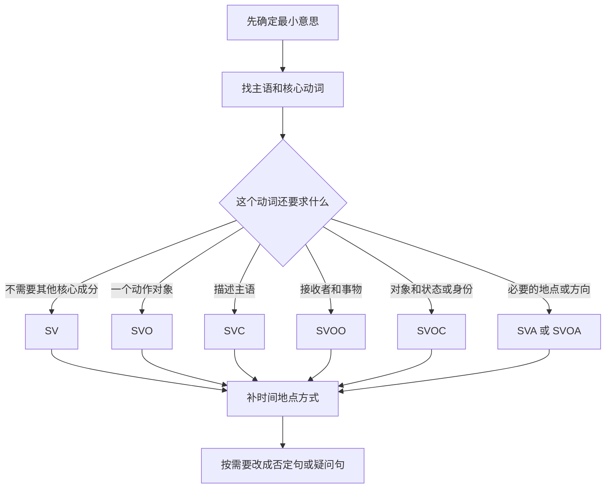

# 英语学习笔记

这份笔记由 `raw/personal/English.md` 重新整理而成。内容按学习逻辑重新编排，并修正了明显的拼写、例句和规则错误。

> [!warning] 使用原则
> 英语发音、重音、介词和短语动词都有例外。本文中的“核心感觉”和“常见规律”用于帮助理解，不应当作无例外公式。遇到新词时，应同时查看音标、例句和真人录音。

## 目录

0. 学习技巧总览
1. 发音、拼读与重音
2. `how` 的用法
3. 介词与空间关系
4. 高频核心动词
5. 小品词与短语动词
6. 语法与句型
7. 高频词汇与表达
8. 机场场景表达
9. 本次纠错记录

## 0. 学习技巧总览

下面这些是原始笔记中最值得保留的“英语思维”。它们的作用是帮助快速建立直觉，不是替代完整语法规则。

| 技巧 | 核心画面 | 示例 | 使用边界 |
| --- | --- | --- | --- |
| 拼读先猜后查 | 字母组合提供候选读音 | `ai/ay` 常读 /eɪ/：`rain/day` | `said` 等例外仍需查词典 |
| 重音与词性一起记 | 同一拼写换词性，重音可能移动 | `CONtract` 名词，`conTRACT` 动词 | 只是常见模式，不适用于所有单词 |
| `in/on/at` | 容器、表面、点或场所 | `in a car`、`on a bus`、`at school` | 不是简单的“不精确到精确” |
| `to` 像箭头 | 指向方向、终点、接收者 | `go to school`、`give it to me` | `to` 还有不定式标记等其他身份 |
| `for` 像受益区 | 为某人、用途、目的或时长 | `This is for you.` | 不能简单等同于“客观” |
| `across/through` | 横过表面、穿过内部 | `across the road`、`through the tunnel` | 具体搭配仍受名词和视角影响 |
| `off/out/away` | 分离、向外、远离 | `take off`、`come out`、`run away` | 短语词义可能已经词汇化 |
| `up/down` | 增强或完成、降低或记录 | `eat up`、`slow down`、`write down` | `give up` 等不能逐字推导 |
| `take` | 把事物或责任拿到自己一侧 | `take a bus`、`take responsibility` | 不同搭配需要整体记忆 |
| `set` | 放到位置并建立状态 | `set up a company`、`set a date` | `set` 的具体义项很多 |
| `turn` | 改变方向、状态或角色 | `turn around`、`turn into` | `turn out` 等有独立词义 |
| `break/cut` | 完整状态被打破、切开或减少 | `break down`、`cut off` | 小品词决定不同结果 |
| `what/how` 感叹 | `what` 看名词，`how` 看程度 | `What a day!`、`How beautiful!` | 完整从句仍用陈述语序 |

> [!tip] 推荐练习法
> 每学一个技巧，至少自己造两个句子：一个使用核心含义，一个使用扩展含义。例如先写 `The plane took off.`，再写 `Please take off your shoes.`，比较同一短语如何随宾语和语境变化。

## 1. 发音、拼读与重音

### 1.1 常见字母组合

#### 完整对照表

| 组合   | 建议先尝试        | 常见例词                    | 其他高频读音或例外                                       | 相对稳定性 |
| ---- | ------------ | ----------------------- | ----------------------------------------------- | ----- |
| `ai` | /eɪ/         | `rain`、`train`、`wait`   | `said /sed/`、`plaid /plæd/`                     | 较高    |
| `ay` | /eɪ/         | `day`、`play`、`stay`     | `says /sez/`、`quay /kiː/`                       | 较高    |
| `ee` | /iː/         | `see`、`green`、`sleep`   | `been` 常读 /bɪn/；非重读词尾可能弱化                       | 很高    |
| `ea` | /iː/         | `eat`、`team`、`clean`    | `head /e/`、`great /eɪ/`、`learn /ɜː/`            | 中等    |
| `oa` | /əʊ/（美 /oʊ/） | `boat`、`road`、`coat`    | `broad /brɔːd/`                                 | 很高    |
| `oe` | /əʊ/（美 /oʊ/） | `toe`、`foe`             | `shoe /uː/`、`does /dʌz/`                        | 中等    |
| `oi` | /ɔɪ/         | `coin`、`point`、`voice`  | 少数借词或非重读音节可能例外                                  | 很高    |
| `oy` | /ɔɪ/         | `boy`、`toy`、`enjoy`     | 常用词中相对稳定                                        | 很高    |

> [!tip] 位置倾向可以降低记忆量
> `ai/oi` 常出现在词中，`ay/oy` 常出现在词尾，如 `rain/day`、`coin/boy`；`oa` 常在词中，`oe` 常在词尾，如 `boat/toe`；`ui` 常在词中，`ue` 常在词尾，如 `fruit/blue`。这只是拼写倾向，不是绝对规则。

补充：`qu` 不是元音组合，通常是辅音拼写，常读 /kw/，如 `quick`、`question`；在 `unique`、`antique` 等借词中常读 /k/。

### 1.2 `-tion` 与 `-sion`

| 形式 | 常见读音 | 示例 |
| --- | --- | --- |
| `-tion` | /ʃən/ | `nation`、`education` |
| `-stion` | /stʃən/ | `question`、`digestion` |
| `-sion` | /ʒən/ | `vision`、`decision` |
| `-sion` | /ʃən/ | `tension`、`mansion` |

`-sion` 的读音不能只靠“前面是元音还是辅音”机械判断，最好连同单词一起记。

### 1.3 规则动词 `-ed` 的发音

规则动词的过去式和过去分词都可能写成 `-ed`，但 `-ed` 有三种常见读音。判断时看动词原形的最后一个**音**，不要只看最后一个字母。

| 原形的最后一个音 | `-ed` 读音 | 例词 | 音节变化 |
| --- | --- | --- | --- |
| `/t/` 或 `/d/` | `/ɪd/` | `wanted`、`needed` | 增加一个音节 |
| 其他清辅音 | `/t/` | `helped`、`looked`、`washed` | 通常不增加音节 |
| 元音或其他浊辅音 | `/d/` | `played`、`loved`、`cleaned` | 通常不增加音节 |

速记：`/t, d/` 后读 `/ɪd/`；其他音摸喉咙，清音配 `/t/`，浊音和元音配 `/d/`。详细原理、例外和口语训练见 [[英语发音学习笔记]]。

### 1.4 常见不发音字母

| 组合 | 规律 | 示例 |
| --- | --- | --- |
| 词首 `kn-` | `k` 通常不发音 | `knee /niː/`、`knock /nɒk/` |
| 词首 `wr-` | `w` 通常不发音 | `write /raɪt/`、`wrong /rɒŋ/` |
| 词尾 `-mb` | `b` 通常不发音 | `comb /kəʊm/`、`bomb /bɒm/` |
| 词尾 `-mn` | `n` 常不发音 | `autumn`、`column` |
| `bt` | `b` 常不发音 | `debt /det/`、`doubt /daʊt/` |
| `wh-` | 多数词读 /w/，部分词读 /h/ | `when /wen/`、`who /huː/` |

> [!tip] 技巧：按字母位置成组记
> 不要孤立背“某个字母不发音”，而要记成“词首 `kn-/wr-`、词尾 `-mb/-mn`、历史拼写 `bt`”。例如把 `knee/knock/know` 放在一组朗读，记忆会更稳定。

### 1.5 重音规律

重读音节通常更长、更响、音高变化更明显，元音也更清楚；非重读音节往往更短并发生弱化。词典音标中的 `ˈ` 放在主重音音节之前，`ˌ` 表示次重音，例如 `computer /kəmˈpjuːtə/`。

重音规律只能用来预测，不能代替词典。

| 类型 | 常见倾向 | 示例 | 边界 |
| --- | --- | --- | --- |
| 单音节词 | 单独读时整个词承担重音 | `cat`、`dog`、`go` | 进入句子后，功能词可能弱读 |
| 双音节名词或形容词 | 常重读第一音节 | `TAble`、`HAPpy` | `hoTEL`、`poLICE` 等是例外 |
| 双音节动词 | 常重读第二音节 | `beGIN`、`deCIDE` | `ANswer`、`VISit` 等是例外 |
| 同形名词和动词 | 名词常在前，动词常在后 | `CONtract` / `conTRACT` | 只适用于部分同形词 |
| `-tion/-sion` 结尾 | 前一个音节常重读 | `eduCAtion`、`deCIsion` | 同时注意前面音节的弱读 |
| `-ic` 结尾 | `-ic` 前一个音节常重读 | `fanTAStic`、`geoGRAPHic` | 添加后缀可能使词根重音移动 |
| `-ee/-eer` 结尾 | 后缀本身常重读 | `employEE`、`engiNEER` | 某些复合词和语境可能有次重音 |
| `-ly/-ness` 结尾 | 通常保留词根重音 | `HAPpy → HAPpiness`、`QUICK → QUICKly` | 这是常见倾向 |

## 2. `how` 的用法

### 2.1 询问方式、程度和感受

| 功能 | 例句 | 中文 |
| --- | --- | --- |
| 询问方式 | `How do you get to work?` | 你怎么去上班？ |
| 询问方法 | `How did you do that?` | 你是怎么做到的？ |
| 询问程度 | `How tired are you?` | 你有多累？ |
| 表示惊讶 | `How is that even possible?` | 这怎么可能？ |

### 2.2 `how + 形容词/副词`

| 结构                  | 用途         | 示例                              |
| ------------------- | ---------- | ------------------------------- |
| `how old`           | 年龄         | `How old is he?`                |
| `how many + 可数名词复数` | 数量         | `How many books do you have?`   |
| `how much + 不可数名词`  | 数量         | `How much water do you need?`   |
| `how much`          | 价格         | `How much is it?`               |
| `how long`          | 时长或长度      | `How long have you lived here?` |
| `how often`         | 频率         | `How often do you exercise?`    |
| `how soon`          | 距离未来还有多久   | `How soon will he come back?`   |
| `how far`           | 距离         | `How far is your home?`         |
| `how tall`          | 人、树等的高度    | `How tall is she?`              |
| `how high`          | 位置、山峰或建筑高度 | `How high is the mountain?`     |

### 2.3 建议、感叹和间接疑问

- `How about + 名词/-ing?`：`How about going shopping?`
- `How + 形容词/副词 + 主语 + 谓语!`：`How fast he runs!`
- 间接疑问使用陈述语序：`Could you tell me how I can get there?`

## 3. 介词与空间关系

### 3.1 `in`、`on`、`at`

| 介词 | 核心关系 | 地点 | 时间 |
| --- | --- | --- | --- |
| `in` | 容器、范围内部 | `in the room`、`in a car` | `in 2026`、`in the morning` |
| `on` | 接触表面、线路、公共交通 | `on the floor`、`on the bus` | `on Monday`、`on 26 September` |
| `at` | 点、地址、活动场所 | `at the door`、`at school` | `at 8:00`、`at night` |

不要把三者简单理解为“不精确、比较精确、非常精确”。关键是说话者如何看待这个位置：

> [!tip] 技巧：容器、表面、地点标记
> 先问自己说话者把地点看成什么：在边界内部用 `in`，接触表面或位于线路上常用 `on`，把地点当作活动点或约定地点常用 `at`。例如 `at the station` 强调车站这个会合点，`in the station` 强调人在站内。

### 3.2 常见对比

| 表达 | 含义 | 对比 |
| --- | --- | --- |
| `in the way` | 挡路 | `Your car is in the way.` |
| `on the way` | 在途中 | `Your pizza is on the way.` |
| `in time` | 及时，赶在太晚之前 | `We arrived in time to board.` |
| `on time` | 按计划准时 | `The train left on time.` |
| `arrive in` | 到达较大的区域 | `arrive in London` |
| `arrive at` | 到达具体地点 | `arrive at the station` |

### 3.3 `to`、`for`、`from`、`of`

| 介词 | 核心关系 | 示例 |
| --- | --- | --- |
| `to` | 方向、终点、接收者、关系目标 | `go to school`、`give it to me` |
| `for` | 受益者、用途、目的、持续时间 | `This is for you.`、`for three years` |
| `from` | 来源、起点、分离 | `from A to B`、`different from` |
| `of` | 所属、组成、特征或名词关系 | `the name of the book`、`a cup of tea` |
| `about` | 关于、大约 | `talk about work`、`about ten minutes` |

`important to me` 常表示“对我个人有意义”；`important for me` 常表示“对我的目标或处境有必要”。它们不是简单的“主观”和“客观”二分。

> [!tip] 技巧：箭头与受益区
> 可以把 `to` 想成指向终点的箭头：`Send the file to me.`；把 `for` 想成某人受益或某物用途所在的区域：`This guide is useful for beginners.`。这个画面适合记方向和受益关系，但不能覆盖所有固定搭配。

### 3.4 `besides`、`except`、`except for`

| 表达 | 是否包含所提对象 | 示例 |
| --- | --- | --- |
| `besides` | 包含，表示“除此之外还有” | `Besides English, she speaks French.` |
| `except` | 排除同类成员 | `Everyone except me passed.` |
| `except for` | 从整体陈述中指出例外 | `The room was quiet except for the fan.` |

### 3.5 时间关系

| 表达 | 含义 | 示例 |
| --- | --- | --- |
| `in five minutes` | 五分钟后 | `I will leave in five minutes.` |
| `in five minutes` | 用五分钟完成 | `I finished it in five minutes.` |
| `within five minutes` | 不超过五分钟 | `Please reply within five minutes.` |
| `after` | 在时间或事件之后 | `Call me after 5:00.` |
| `by tomorrow` | 最迟在明天之前 | `Finish it by tomorrow.` |

`after` 可以用于过去、现在和将来，并不只属于过去时。

### 3.6 路径、工具和关系

| 介词 | 核心感觉 | 示例 |
| --- | --- | --- |
| `across` | 横过表面或区域 | `walk across the street` |
| `through` | 穿过内部空间 | `walk through the forest` |
| `over` | 在上方、越过、遍及 | `fly over the mountain` |
| `past` | 从旁边经过 | `walk past the shop` |
| `into` | 向内部移动或发生变化 | `go into the room`、`turn into` |
| `with` | 一起、具有、使用工具 | `with my daughter`、`with a knife` |
| `by` | 在旁边、通过方式、截止时间 | `by the door`、`by bus`、`by Friday` |
| `against` | 接触支撑、反对、对抗 | `lean against the wall` |
| `like` | 像 | `He looks like me.` |

注意：应写 `by bus`，不是 `buy bus`；应写 `walk across the street`，不是 `walk cross the street`。

> [!tip] 技巧：二维表面与三维通道
> `across` 常强调从区域一边到另一边，如 `She ran across the field.`；`through` 常强调进入并穿过内部，如 `The train went through the tunnel.`。`past` 则只强调从旁边经过：`I walked past the bank.`

几个适合整体记忆的 `against/from/into` 搭配：

| 搭配 | 含义 | 例句 |
| --- | --- | --- |
| `check A against B` | 对照 B 检查 A | `Check the report against the original data.` |
| `compare A against B` | 把 A 与 B 比较 | `Compare this year's sales against last year's.` |
| `validate A against B` | 根据 B 验证 A | `Validate the code against the security rules.` |
| `protect sb from sth` | 保护某人免受某事影响 | `This coat protects you from the cold.` |
| `prevent/stop/keep sb from doing` | 阻止某人做某事 | `The rain kept us from going out.` |
| `divide/separate sth into...` | 把某物分成若干部分 | `Divide the class into four groups.` |
| `translate A into B` | 把 A 翻译成 B | `Translate the sentence into English.` |

## 4. 高频核心动词

### 4.1 `get`

| 结构 | 含义 | 示例 |
| --- | --- | --- |
| `get + 名词` | 得到、收到 | `I got a gift.` |
| `get to + 地点` | 到达 | `get to school` |
| `get + 地点副词` | 到达 | `get home`，不加 `to` |
| `get + 形容词` | 变得 | `get tired`、`get dark` |
| `get sb to do` | 设法让某人做 | `Could you get him to help?` |
| `get sth done` | 让某事被完成 | `I got my bike repaired.` |
| `get doing` | 开始做 | `Let's get going.` |

`get doing` 不应随意推广到所有动词，它常出现在 `get going`、`get moving`、`get talking` 等表示开始行动的表达中。

### 4.2 `make`

| 结构 | 含义 | 示例 |
| --- | --- | --- |
| `make + 名词` | 制作 | `make coffee` |
| `make + 宾语 + 形容词` | 使进入某状态 | `You make me happy.` |
| `make sb do` | 让或迫使某人做 | `Don't make me wait.` |
| `make up` | 编造、组成、化妆、和好或补偿 | `make up a story` |

`make sb do` 后面的动词不带 `to`。

`make up` 的多个义项可以用“补足、组合成完整状态”辅助记忆，但仍要结合宾语判断：

| 含义 | 例句 |
| --- | --- |
| 编造 | `He made up an excuse.` |
| 组成 | `Women make up half of the team.` |
| 和好 | `They argued yesterday but made up this morning.` |
| 补偿 | `I'm sorry; let me make it up to you.` |
| 化妆 | `She made herself up for the performance.` |

### 4.3 `have`

| 结构 | 含义 | 示例 |
| --- | --- | --- |
| `have + 名词` | 拥有、经历、吃喝 | `have breakfast` |
| `have sb do` | 安排某人做 | `I'll have him call you.` |
| `have sth done` | 让某事被处理 | `I had my phone fixed.` |

### 4.4 `take`

`take` 的核心感觉是“把东西、动作或责任拿到自己这一侧”。

| 用法 | 示例 |
| --- | --- |
| 拿、带走 | `Take this bag.` |
| 接受或选择 | `I'll take this one.` |
| 乘坐 | `take a bus` |
| 花费时间 | `It takes ten minutes.` |
| 参加或经历 | `take an exam`、`take a break` |
| 带某人去 | `I'll take you home.` |
| 承担 | `take responsibility` |

### 4.5 `go`

| 结构 | 含义 | 示例 |
| --- | --- | --- |
| `go + 地点` | 前往 | `Go home.` |
| `go + 形容词` | 进入某种状态 | `go bad`、`go wrong` |
| `go + -ing` | 去参加活动 | `go shopping`、`go swimming` |

## 5. 小品词与短语动词

### 5.1 小品词的常见联想

| 小品词 | 常见联想 | 示例 |
| --- | --- | --- |
| `up` | 向上、增强、完成 | `turn up`、`eat up`、`cheer up` |
| `down` | 向下、减弱、记录 | `slow down`、`cut down`、`write down` |
| `off` | 分离、停止、离开 | `turn off`、`take off`、`cut off` |
| `out` | 向外、显现、耗尽 | `point out`、`come out`、`run out` |
| `away` | 远离、移走 | `run away`、`give away` |
| `over` | 越过、接管、克服、复查 | `take over`、`get over`、`look over` |

这些只是联想线索。短语动词往往已经形成独立词义，应把整个短语一起记。

> [!tip] 技巧：把“能否拆开”也当作词义的一部分
> 可分短语动词可以写 `turn off the light` 或 `turn the light off`，但宾语是代词时必须写 `turn it off`。不可分结构要保持顺序，例如 `look after her`，不能写 `look her after`；三词结构同样写 `put up with it`。

### 5.2 `give` 词族

| 短语 | 含义 | 例句 |
| --- | --- | --- |
| `give up` | 放弃 | `Don't give up after one mistake.` |
| `give in` | 屈服、让步 | `After hours of arguing, he finally gave in.` |
| `give away` | 赠送、泄露 | `She gave away her old clothes.` |
| `give out` | 分发；耗尽、停止运转 | `Volunteers gave out water.` / `My battery gave out.` |
| `give off` | 散发气味、热、光或气体 | `The flowers give off a sweet smell.` |
| `give sb a hand` | 帮某人一把 | `Could you give me a hand with this box?` |
| `give way` | 让路、让步 | `Drivers must give way to pedestrians.` |

### 5.3 `look` 词族

| 短语 | 含义 | 例句 |
| --- | --- | --- |
| `look forward to + -ing` | 期待做某事 | `I'm looking forward to meeting you.` |
| `look out` | 当心 | `Look out! There's a car coming.` |
| `look around` | 环顾、到处看看 | `We looked around the old town.` |
| `look up` | 查阅；向上看 | `Look the word up in a dictionary.` |
| `look down` | 向下看 | `Don't look down while climbing.` |
| `look through` | 浏览 | `I looked through the documents.` |
| `look after` | 照顾 | `Can you look after my dog?` |
| `look for` | 寻找尚未找到的东西 | `I'm looking for my keys.` |
| `look over` | 快速检查 | `Please look over my report.` |

`look forward to` 中的 `to` 是介词，因此后面接名词或 `-ing`：`I look forward to meeting you.`

### 5.4 `get` 词族

| 短语 | 含义 | 例句 |
| --- | --- | --- |
| `get on` | 上公共交通；进展 | `Get on the bus.` / `How are you getting on at work?` |
| `get off` | 下公共交通；下班 | `Get off at the next stop.` / `I get off work at six.` |
| `get up` | 起床、站起来 | `I get up at seven every day.` |
| `get along/on with` | 与某人相处 | `I get along well with my colleagues.` |
| `get over` | 克服、从疾病或打击中恢复 | `It took her weeks to get over the flu.` |
| `get in touch with` | 与某人取得联系 | `I'll get in touch with you tomorrow.` |

### 5.5 `take` 词族

| 短语 | 含义 | 例句 |
| --- | --- | --- |
| `take care of` | 照顾、处理 | `I'll take care of the problem.` |
| `take off` | 起飞；脱下 | `The plane took off on time.` / `Take off your coat.` |
| `take on` | 承担、接受挑战 | `She took on more responsibility.` |
| `take over` | 接管 | `A new manager will take over the project.` |
| `take part in` | 参加 | `More than 100 students took part in the race.` |
| `take place` | 发生 | `The meeting will take place on Friday.` |
| `take a look` | 看一眼 | `Take a look at this photo.` |
| `take a break` | 休息一下 | `Let's take a break after this exercise.` |
| `take advantage of` | 利用 | `Take advantage of this opportunity.` |
| `take your time` | 慢慢来，不着急 | `Take your time; I'm not in a hurry.` |
| `take up` | 开始从事；占用时间或空间 | `She took up jogging.` / `This desk takes up too much space.` |

> [!tip] 技巧：把 `take` 想成“拿到自己这一侧”
> `take on responsibility` 是把责任承担过来，`take over a project` 是把项目控制权接过来，`take up space` 是某物把空间占走。这个核心画面可以串联词义，但最终仍要结合完整搭配。

### 5.6 `come`、`bring`、`put`、`set`

| 短语 | 含义 | 例句 |
| --- | --- | --- |
| `come across` | 偶然遇到或发现 | `I came across an old photo yesterday.` |
| `come over` | 过来、来访 | `Why don't you come over for dinner?` |
| `come up with` | 想出 | `She came up with a practical solution.` |
| `come out` | 出来、出版、结果显现 | `Her new book comes out next month.` |
| `come true` | 愿望实现 | `I hope your dream comes true.` |
| `bring back` | 带回来；使回忆起 | `This song brings back happy memories.` |
| `bring in` | 引入、带来收入 | `The new service brought in more customers.` |
| `bring down` | 降低、打倒 | `We need to bring down costs.` |
| `bring up` | 抚养；提出话题 | `She brought up an important question.` |
| `bring forward` | 提前；提出 | `The meeting was brought forward to Monday.` |
| `put up` | 张贴、搭建 | `They put up a tent beside the lake.` |
| `put up with` | 容忍 | `I can't put up with the noise.` |
| `put down` | 放下、记下 | `Put down his phone number.` |
| `put off` | 推迟 | `They put off the meeting until Friday.` |
| `put forward` | 提出 | `She put forward a new proposal.` |
| `put out` | 扑灭 | `Firefighters put out the fire.` |
| `put on` | 穿上；增加体重；上演 | `Put on your coat before you leave.` |
| `put aside` | 留出、储存 | `Put aside some money every month.` |
| `set out` | 出发；着手做 | `We set out early in the morning.` |
| `set off` | 出发；引发、触发 | `Smoke from the kitchen set off the alarm.` |
| `set up` | 建立、安装、安排 | `They set up a new company.` |

> [!tip] 技巧：`set` 是“放置并建立状态”
> `set up a company` 是把组织建立起来，`set up the computer` 是把设备安装到可用状态，`set a date` 是把日期确定下来。这个画面比只背“设置”更容易迁移。

### 5.7 `go`、`pass`、`turn`

| 短语 | 含义 | 例句 |
| --- | --- | --- |
| `go on` | 继续 | `Please go on; I'm listening.` |
| `go through` | 经历；逐项检查 | `She went through a difficult time.` |
| `go over` | 复习、检查 | `Let's go over the plan again.` |
| `go out` | 外出；熄灭 | `The lights went out suddenly.` |
| `go off` | 警报响；爆炸；变质 | `The alarm went off at six.` |
| `go against` | 反对、违背 | `This decision goes against our rules.` |
| `go after` | 追赶、追求 | `She is going after her dream.` |
| `pass out` | 昏倒；分发 | `He passed out from the heat.` |
| `pass away` | 去世，委婉表达 | `Her grandfather passed away last year.` |
| `pass by` | 经过 | `I passed by your house yesterday.` |
| `pass on` | 传递、转告 | `Please pass on the message.` |
| `pass down` | 传给下一代 | `The recipe was passed down in the family.` |
| `pass over` | 跳过、忽略 | `Let's pass over that detail for now.` |
| `turn on/off` | 打开或关闭 | `Turn off the lights before you leave.` |
| `turn up/down` | 出现或调大；拒绝或调小 | `He turned up late.` / `She turned down the offer.` |
| `turn around` | 转身、扭转 | `Turn around and look at me.` |
| `turn into` | 变成 | `The discussion turned into an argument.` |
| `turn out` | 结果是；到场 | `The rumour turned out to be true.` |
| `turn over` | 翻转；移交 | `Turn over the page.` |
| `turn to` | 转向、求助于 | `She turned to her friends for help.` |
| `take turns` | 轮流 | `Let's take turns driving.` |

#### `turn out to be`：结果发现是……

`turn out` 表示事情最后以某种方式发展，或原先不确定的情况后来被证实。它常带有“起初不知道，后来结果显现”的意味。

> **主语 + turn out + to be + 表语**

`The party turned out to be very fun.` 表示“结果发现，这个派对非常有趣”或“这个派对最后证明很好玩”。句子可以拆成：

- `The party`：主语。
- `turned out`：谓语，表示“结果是、最后发现”。
- `to be`：不定式结构，连接后面的说明成分。
- `very fun`：表语，说明 `the party` 最后呈现出的状态。

`fun` 在非正式英语中可以作形容词，因此 `very fun` 是自然表达；也可以说 `The party turned out to be a lot of fun.`，其中 `a lot of fun` 是名词短语。

| 常用结构                             | 用途          | 例句                                            |
| -------------------------------- | ----------- | --------------------------------------------- |
| `主语 + turn out + to be + 形容词`    | 结果发现处于某种状态  | `The rumour turned out to be true.`           |
| `主语 + turn out + to be + 名词（短语）` | 结果发现是某人或某事物 | `The call turned out to be a scam.`           |
| `主语 + turn out + 形容词/副词`         | 直接说明最终结果    | `Everything turned out fine.`                 |
| `It turns/turned out that + 从句`  | 引出后来发现的完整事实 | `It turned out that I had the wrong address.` |

不要把 `turn out to be` 和 `turn into` 混在一起：`turn out to be` 强调真相或结果后来显现，如 `The quiet man turned out to be the owner.`；`turn into` 强调真的发生了变化，如 `The discussion turned into an argument.`。

> [!tip] 技巧：`turn` 串联“方向、状态、角色改变”
> `turn around` 改变朝向，`turn into` 改变状态，`turn to someone` 把注意力和求助方向转向某人。`turn out` 已形成独立用法，常表示“结果是”或“到场”。

### 5.8 `keep`、`break`、`cut`

| 短语                   | 含义         | 例句                                            |
| -------------------- | ---------- | --------------------------------------------- |
| `keep doing`         | 持续做        | `Keep practising every day.`                  |
| `keep up with`       | 跟上         | `I can't keep up with this pace.`             |
| `keep sb from doing` | 阻止某人做      | `The rain kept us from going out.`            |
| `keep away from`     | 远离         | `Keep away from the edge.`                    |
| `keep in touch with` | 保持联系       | `I keep in touch with my old classmates.`     |
| `break down`         | 坏掉、分解、情绪崩溃 | `Our car broke down on the way home.`         |
| `break up`           | 分手、解散      | `The band broke up last year.`                |
| `break in`           | 闯入；插话      | `Sorry to break in, but this is urgent.`      |
| `break into + 地点`    | 闯入某处       | `Someone broke into the office.`              |
| `break out`          | 爆发         | `A fire broke out during the night.`          |
| `break through`      | 突破         | `The team broke through a technical barrier.` |
| `break away`         | 脱离、摆脱      | `One runner broke away from the group.`       |
| `cut off`            | 切断         | `The storm cut off the power.`                |
| `cut up`             | 切碎         | `Cut up the vegetables.`                      |
| `cut down`           | 减少；砍倒      | `I'm trying to cut down on sugar.`            |
| `cut out`            | 剪下、删除、停止   | `Cut out the unnecessary paragraph.`          |
| `cut in`             | 插话、插队      | `Don't cut in while she is speaking.`         |

> [!tip] 技巧：从“完整状态发生变化”理解 `break/cut`
> `break down` 是整体失去正常状态，`break up` 是整体分散，`break away` 是从整体脱离；`cut off` 是切断连接，`cut down` 是向下砍或减少数量，`cut out` 是把一部分切除。

## 6. 语法与句型

### 6.1 先校准“五大句型”

句型不是把中文逐字换成英文，而是为一个 clause（分句）选择骨架。先记住五个符号：

| 符号 | 英文 | 作用 | 示例 |
| --- | --- | --- | --- |
| `S` | subject | 主语：句子在说谁或什么 | `She` smiled. |
| `V` | verb | 谓语动词；可包含助动词 | She `is working`. |
| `O` | object | 宾语：动作涉及的人或事物 | I need `help`. |
| `C` | complement | 补语：说明主语或宾语是什么、怎么样 | She is `tired`. |
| `A` | adverbial | 状语：地点、时间、方式等 | He lives `in London`. |

传统“五大基本句型”通常是 `SV / SVO / SVC / SVOO / SVOC`。你看到的口诀把 `SV/SVO` 合在“做什么”下面，再把 `There be` 单列出来，适合快速记忆，但需要稍微校准：

| 想表达什么 | 句型 | 自然例句 | 怎么判断 |
| --- | --- | --- | --- |
| 谁做了某事，动作不需要对象 | `SV` | `She smiled.` / `The baby is sleeping.` | 主语和动词已经能表达完整动作 |
| 谁对什么做了某事 | `SVO` | `I need help.` / `She speaks English.` | 动词后还需要一个动作对象 |
| 主语是什么或怎么样 | `SVC` | `I am tired.` / `The soup smells good.` | `C` 描述的就是 `S` |
| 给谁、告诉谁或为谁准备什么 | `SVOO` | `She gave me some advice.` | 第一个宾语通常是接收者，第二个是事物 |
| 使、认为或称呼某人/某物怎么样 | `SVOC` | `The news made me nervous.` | `O` 与 `C` 能组成“宾语是/变得……” |

#### `SV` 与 `SVO`：都可以表示“做什么”

差别不在中文里有没有“做”，而在核心动词是否需要宾语：

- `I laughed.`：`laugh` 不需要宾语，使用 `SV`。
- `I opened the door.`：`open` 后面说明打开什么，使用 `SVO`。
- `She is reading.`：不强调读什么时可以是 `SV`。
- `She is reading a novel.`：说出阅读对象后是 `SVO`。

#### `SVC`：“是什么、怎么样”

`V` 不只有 `be`，还常见 `seem`、`become`、`feel`、`look`、`smell`、`sound`、`taste`、`get` 和 `stay`：

- `You look tired.` 你看起来很累。
- `The plan sounds good.` 这个计划听起来不错。
- `He became a teacher.` 他成为了一名教师。
- `The weather got cold.` 天气变冷了。

补语与主语指向同一个人或事物：`he = a teacher`，`the plan = good`。

#### `SVOO`：“给谁什么”

- `She gave me a key.` 她给了我一把钥匙。
- `He bought me coffee.` 他给我买了咖啡。
- `Could you send me the file?` 你能把文件发给我吗？

很多双宾语结构可以改写：

- `She gave me a key.` → `She gave a key to me.`
- `He bought me coffee.` → `He bought coffee for me.`

但不是所有动词都能这样用。应说 `Please explain the rule to me.`，不说 `Please explain me the rule.`

#### `SVOC`：“让/认为/称呼某人怎么样”

- `The news made me nervous.` 这个消息让我紧张。
- `We call him Jack.` 我们叫他 Jack。
- `They painted the door blue.` 他们把门漆成了蓝色。
- `I found the room empty.` 我发现房间是空的。

可以用一个小测试判断宾补：`me = nervous`、`him = Jack`、`the door = blue`、`the room = empty`。

#### `There be`：“某处有某物”

`There be` 用来首次引入某人或某物的存在、出现或位置：

- `There is a café near my office.` 我办公室附近有一家咖啡馆。
- `There are two seats left.` 还剩两个座位。
- `There was a problem yesterday.` 昨天出了一个问题。
- `There will be a meeting tomorrow.` 明天会有一场会议。

这里的 `there` 是 dummy subject（形式主语），不表示具体的“那里”。传统五大句型通常不把它算作第五种基本句型，而把它视为单独的 existential construction（存在结构）。正式写作和考试中宜保持单复数一致：`There is one reason.` / `There are two reasons.`

`There be` 与 `have` 的焦点也不同：

- `There is a problem.`：存在一个问题。
- `I have a problem.`：我遇到了或拥有一个问题。

### 6.2 常见的七种 clause patterns

除了传统五大句型，另一种常见教学法还补充 `SVA` 和 `SVOA`：

| 句型 | 核心关系 | 例句 |
| --- | --- | --- |
| `SVA` | 动词的这个义项还需要地点、时间或方向等信息 | `My parents live in Shanghai.` |
| `SVOA` | 动词同时需要宾语和地点、方向等信息 | `Please put your phone on the table.` |

`Please put your phone.` 通常不完整，因为 `put` 的“放置”义既要说明放什么，也要说明放到哪里。反过来，`I called you yesterday.` 去掉 `yesterday` 仍然完整，因此核心仍是 `SVO`，`yesterday` 只是附加状语。

> [!info] 分类边界
> 不同语法体系可能把某些地点成分标成 `A`，也可能标成必需的 `C`。所以“五种”或“七种”不是英语仅有的句子数量。口语学习真正需要掌握的是：这个动词的当前义项后面还要求什么。

### 6.3 “不知道怎么说”时的口语造句流程

入口是你真正想传达的**最小信息**，不要一开始就逐字翻译一整句复杂中文。先确定句子在说谁或什么，再选择最能承载意思的核心动词。随后检查这个动词的 verb pattern：动作能独立完成就走 `SV`；需要对象就走 `SVO`；要描述主语就走 `SVC`；涉及接收者和事物就走 `SVOO`；要说明宾语的身份、状态或结果就走 `SVOC`；`live/put` 等义项还可能要求地点或方向。骨架完整后，再补时间、地点和方式；最后才用 `be`、`do`、`have` 或情态动词改成否定句、一般疑问句或特殊疑问句。最终目标是先说出一个准确的短句，再逐步扩展，而不是一次翻译整段中文。

例如想说“我昨天在会议上给同事发了文件”：

1. 最小意思：我发了文件。
2. 主语和动词：`I sent...`
3. 谁收到、收到什么：`I sent my colleague the file.`（`SVOO`）
4. 补时间和地点：`I sent my colleague the file at the meeting yesterday.`

如果长句一时说不出来，先拆成两个短句也完全自然：

- `I missed the bus, so I was late.`
- `I don't know the exact word, but I can explain the idea.`

### 6.4 同一个主题怎样选择不同骨架

| 想表达的重点 | 英语 | 骨架 |
| --- | --- | --- |
| 我很紧张 | `I feel nervous.` | `SVC` |
| 这件事让我紧张 | `This makes me nervous.` | `SVOC` |
| 我需要一点时间 | `I need some time.` | `SVO` |
| 请给我一点时间 | `Please give me a minute.` | 祈使句中的 `VOO`，主语 `you` 省略 |
| 我的手机在桌上 | `My phone is on the table.` | 常分析为 `SVA` 或 `SVC` |
| 我把手机放在桌上了 | `I put my phone on the table.` | `SVOA` |
| 我的电脑有点问题 | `There is something wrong with my computer.` | `There be` 存在结构 |
| 我觉得这个主意不错 | `I think this idea is good.` | 主句 `SVO`，宾语是一个 clause |

不会表达时可以直接使用这些求助句：

- `How do you say this in English?` 这句话用英语怎么说？
- `How can I say this naturally in English?` 这句话怎样用英语说得自然？
- `I know what I mean, but I don't know how to say it in English.` 我知道自己的意思，但不知道怎样用英语表达。
- `I don't know the exact word, but it means...` 我不知道准确的单词，但它的意思是……

### 6.7 感叹句

`what` 修饰名词短语：

- `What a nice day!`
- `What funny stories!`
- `What terrible weather!`

`how` 修饰形容词、副词或动词短语：

- `How beautiful!`
- `How fast he runs!`
- `How cold it is!`

完整结构：

| 结构 | 示例 |
| --- | --- |
| `What + a/an + 形容词 + 单数名词 + 主语 + 谓语!` | `What a beautiful flower it is!` |
| `What + 形容词 + 复数/不可数名词 + 主语 + 谓语!` | `What terrible weather we have!` |
| `How + 形容词/副词 + 主语 + 谓语!` | `How fast he runs!` |

> [!tip] 技巧：看核心词是名词还是程度
> 想感叹“多么漂亮的一朵花”，核心是名词 `flower`，用 `What a beautiful flower!`；想感叹“多漂亮”，核心是形容词 `beautiful`，用 `How beautiful!`。口诀可以记成：`what` 后面找名词，`how` 后面找形容词或副词。

### 6.8 否定或限制成分置于句首

当 `never`、`rarely`、`hardly`、`seldom` 或限制性状语位于句首时，常用部分倒装：

| 普通语序 | 倒装语序 |
| --- | --- |
| `I have never seen that.` | `Never have I seen that.` |
| `He rarely goes out.` | `Rarely does he go out.` |
| `You can relax only after work.` | `Only after work can you relax.` |

注意：`Only John knows the answer.` 中 `only` 修饰主语，不发生倒装。

### 6.11 `as` 的常见结构

| 结构 | 含义 | 示例 |
| --- | --- | --- |
| `as + 形容词 + as` | 与……一样 | `He is as tall as his brother.` |
| `倍数 + as...as` | 是……的几倍 | `My book is twice as big as yours.` |
| `as soon as` | 一……就…… | `I'll call you as soon as I arrive.` |
| `as long as` | 只要 | `As long as you're happy, I'm happy.` |
| `as far as` | 就……而言 | `As far as I know...` |
| `as well as` | 以及；除……之外还 | `She speaks French as well as English.` |
| `as...as possible` | 尽可能…… | `Please arrive as early as possible.` |

`as` 还可以表示身份、同时发生或原因：

- `He works as a teacher.`
- `As I was getting into my car, the phone rang.`
- `As it was raining, we stayed home.`

> [!tip] 技巧：`as` 是“身份或相等”，`like` 是“相似”
> `He works as a teacher.` 表示他就是教师；`He speaks like a teacher.` 表示他说话像教师，但不说明他的职业。原笔记里的“`as` 表示一样”只覆盖了 `as...as` 比较结构，不能替代 `like`。

### 6.12 人称代词：先看它在句子里的角色

人称代词（personal pronouns）用来指代说话者、听话者以及其他人或事物。不要把 `I/me/my/mine/myself` 当成五个互不相关的单词；它们都指“我”，只是承担的句子角色不同。

| 指代 | 主格：作主语 | 宾格：作宾语或介词宾语 | 物主限定词：后接名词 | 名词性物主代词：独立使用 | 反身代词 |
| --- | --- | --- | --- | --- | --- |
| 我 | `I` | `me` | `my` | `mine` | `myself` |
| 你；你们 | `you` | `you` | `your` | `yours` | `yourself / yourselves` |
| 他 | `he` | `him` | `his` | `his` | `himself` |
| 她 | `she` | `her` | `her` | `hers` | `herself` |
| 它 | `it` | `it` | `its` | 通常不用 | `itself` |
| 我们 | `we` | `us` | `our` | `ours` | `ourselves` |
| 他们；她们；它们 | `they` | `them` | `their` | `theirs` | `themselves` |

#### 反身代词：动作回到主语自己

主语和宾语指向同一个人或事物时，使用反身代词：

- `I hurt myself.` 我弄伤了自己。
- `She taught herself English.` 她自学了英语。
- `They introduced themselves.` 他们做了自我介绍。

反身代词也能表示“亲自”或“独自”：

- `I made it myself.` 这是我亲自做的。
- `He lives by himself.` 他独自居住。

不要为了显得正式而用 `myself` 代替普通主格或宾格。应说 `I will contact you.` 和 `Please contact me.`，不说 `Myself will contact you.` 或 `Please contact myself.`

不要只背表格；固定一个句型，快速更换人物和代词：

1. `I called Anna.` → `I called her.`
2. `Anna called me.` → `She called me.`
3. `This is my bag.` → `This bag is mine.`
4. `Tom and I work together.` → `We work together.`
5. `I made this meal.` → `I made this meal myself.`

完整规则、常见错误和更多替换训练见 [[英语人称代词与所有格]]。

### 7.3 常用表达

| 表达                                 | 含义            | 示例或说明                                                     |
| ---------------------------------- | ------------- | --------------------------------------------------------- |
| `at least`                         | 至少            | `You should sleep at least seven hours.`                  |
| `replace A with B`                 | 用 B 替换 A      | `replace the old bridge with a new one`                   |
| `substitute A for B`               | 用 A 代替 B      | `You can substitute yogurt for cream.`                    |
| `whatever it is`                   | 无论是什么         | `Whatever it is, I'll support you.`                       |
| `focus on doing`                   | 专注做某事         | `She is focusing on preparing for the exam.`              |
| `escape from`                      | 从……逃离         | `The prisoner escaped from the building.`                 |
| `hammer/drive the point home`      | 把要点讲透、反复强调    | `The teacher used examples to drive the point home.`      |
| `care about`                       | 关心、在意         | `Many young people care about the environment.`           |
| `look sb in the eyes`              | 直视某人的眼睛       | `He looked me in the eyes and told the truth.`            |
| `hold sb close`                    | 紧紧抱住某人        | `She held her children close during the storm.`           |
| `way too`                          | 太、过于，强调程度     | `This coffee is way too hot to drink.`                    |
| `find emotional balance in nature` | 在自然中调节情绪、寻找平衡 | `She finds emotional balance by spending time in nature.` |

### 7.4 `right` 表示“恰好、就在”

| 空间                                   | 时间                         |
| ------------------------------------ | -------------------------- |
| `right over there` 就在那边              | `right now` 就是现在           |
| `right next to it` 紧挨着它              | `right away` 立刻            |
| `right behind you` 就在你后面             | `right after` 紧接着          |
| `right in front of you` 就在你正前方       | `right before` 就在……之前      |
| `right around the corner` 就在拐角处、即将发生 | `right on time` 正好准时       |
| `right across the street` 就在街对面      | `I'll be right back.` 马上回来 |

> [!tip] 技巧：把 `right` 理解为“准确落在这里或此刻”
> `right next to it` 强调位置恰好紧邻，`right now` 强调时间就是此刻，`right on time` 强调准确踩在预定时间点上。这个含义与“正确的、右边的”是不同义项。

### 7.5 数字界面操作

| 表达 | 含义 | 例句 |
| --- | --- | --- |
| `zoom in` | 放大画面 | `Zoom in to read the small text.` |
| `zoom out` | 缩小画面 | `Zoom out to see the whole map.` |
| `swipe left` | 向左滑动 | `Swipe left to see the next photo.` |
| `data migration` | 数据迁移 | `The data migration will start tonight.` |

### 7.6 原笔记中的实用句子

| 句子 | 自然含义 | 学习点 |
| --- | --- | --- |
| `What more do you want?` | 你还想要什么？ | `more` 修饰疑问代词 `what` |
| `Why has it taken you so long?` | 你为什么花了这么久？ | 现在完成时连接过去耗时与当前结果 |
| `Maybe my internet isn't going to be that great.` | 我的网络可能没那么好。 | `that` 作程度副词，表示“那么” |
| `That's not how it works.` | 事情不是这样运作的。 | `how` 引导表语从句 |
| `How is that even possible?` | 这怎么可能？ | `even` 加强惊讶语气 |
| `People would lose their minds over this.` | 人们遇到这事会非常震惊或失控。 | `lose one's mind` 是夸张口语 |
| `You guys are way too calm about this.` | 你们对这件事也太冷静了。 | `way too` 强调程度；`you guys` 较口语 |
| `What's going on?` | 怎么回事？ | 高频口语问句 |
| `What does this have to do with learning English?` | 这和学英语有什么关系？ | `have to do with` 表示“与……有关” |
| `The bill always comes due.` | 代价终究要偿还。 | 可用于账单，也可比喻后果终会到来 |
| `What's it costing your kids?` | 这让你的孩子付出了什么代价？ | `cost` 可表示金钱以外的损失 |
| `What is it going to do now?` | 它接下来会做什么？ | `be going to` 表示预期的下一步 |

`regular coffee` 的含义依场景而定，通常表示普通咖啡；在部分北美场景也可能指含咖啡因咖啡或常规杯型。点单时若可能产生歧义，直接说清 `caffeinated/decaf`、杯型和是否加奶更可靠。

## 8. 机场场景表达

### 8.1 购票

- `Would you like to travel first class or economy?`
- `Would you like a one-way or round-trip ticket?`
- `Are there any discounted tickets available?`
- `What's the departure time?`
- `What time is the next flight to the United States?`
- `Where do I pick up the ticket?`
- `Are there any alternatives?`
- `Let me check whether there are any seats available.`

### 8.2 值机和安检

- `Do you know where security is?`
- `Is this where I check in?`
- `I'm afraid of flying.`
- `When will the meals be served?`
- `Here you go.`
- `Go ahead.`

`check in` 是办理值机手续，不等于“检票”。`security` 在机场语境中通常指安检区域。

### 8.3 行李提取

- `Where is baggage claim?`
- `Let me see if I can help.`
- `What would happen if I picked up the wrong luggage?`
- `Be prepared to wait. I've been standing here for ten minutes.`

`baggage claim` 比 `luggage pickup spot` 更自然；美式英语常用 `baggage`，英式英语常用 `luggage`。

## 9. 本次纠错记录

| 原笔记问题 | 整理后的处理 |
| --- | --- |
| 把拼读和重音写成无例外规则 | 改为常见倾向，并补充反例与查词典建议 |
| “多音节词倒数第三音节重读” | 删除为通则，改为按词和后缀观察重音 |
| `walk cross the street` | 改为 `walk across the street` |
| `buy bus/car` | 改为 `by bus/car` |
| `run out` 译为“买光了” | 改为“用完、耗尽”；“卖光”通常是 `sell out` |
| `cut off` 写在 `up` 的“切碎”示例中 | 改为 `cut up` |
| `use off` | 改为常见表达 `use up` |
| `down 向上` | 改为“向下、减弱、记录” |
| `as bed as` | 改为 `as bad as` |
| `his bother` | 改为 `his brother` |
| `class room` | 改为 `classroom` |
| `seperate` | 改为 `separate` |
| “after/before 只用于过去” | 删除；`after/before` 可用于多种时态 |
| “to 主观、for 客观” | 改为方向/目标与受益/用途的核心关系 |
| `Is this where I check in?` 译为检票 | 改为办理值机手续 |
| 把 `as` 和“像”直接等同 | 区分 `as + 身份` 与 `like + 相似对象` |
| `seek regulation in nature` 搭配生硬 | 按原意改为 `find emotional balance by spending time in nature` |

> [!question] 待验证
> 原始笔记开头引用了一段 Bilibili 视频及站内笔记，但本次没有把视频内容作为独立外部来源摄入。“大口和小口”也没有附定义或例词，无法准确判断它指口型、元音分类还是课程内部口诀，因此没有自行补写。本文已用 Cambridge Dictionary 与 British Council 的公开语法资料核对关键规则；仍建议对具体单词的音标和重音逐词查学习词典。

## 相关

- [[英语基本句型与口语造句]] — 五大句型、七种 clause patterns 与口语造句流程
- [[英语发音与重音]] — 拼读、弱读和重音为什么只能作为倾向
- [[英语介词的空间模型]] — 介词核心关系与固定搭配
- [[英语高频动词与短语动词]] — 动词、小品词和多词动词结构
- [[英语疑问感叹与倒装结构]] — `how/what`、间接疑问与倒装

### 原始记录

- [原始个人记录](../../raw/personal/English.md) — 未经整理的增量学习记录

### 外部核查资料

- [University of Florida Literacy Institute：Long Vowel Teams](https://ufli.education.ufl.edu/foundations/toolbox-aus/84-88/)
- [University of Florida Literacy Institute：Scope and Sequence](https://ufli.education.ufl.edu/wp-content/uploads/2022/01/UFLI-Scope-and-Sequence-5-21-2.pdf)
- [Reading Rockets：Phonics in Practice](https://www.readingrockets.org/reading-101/reading-101-learning-modules/course-modules/phonics/practice)
- [Reading Rockets：Six Syllable Types](https://www.readingrockets.org/topics/spelling-and-word-study/articles/six-syllable-types)
- [Cambridge 发音例词：plaid](https://dictionary.cambridge.org/pronunciation/english/plaid)、[broad](https://dictionary.cambridge.org/us/pronunciation/english/broad)、[soup](https://dictionary.cambridge.org/pronunciation/english/soup)、[build](https://dictionary.cambridge.org/pronunciation/english/build)
- [British Council：Word stress](https://www.teachingenglish.org.uk/professional-development/teachers/teaching-knowledge-database/t-w/word-stress)
- [British Council：地点介词 in/on/at](https://learnenglish.britishcouncil.org/free-resources/grammar/a1-a2/prepositions-place)
- [British Council：时间介词 in/on/at](https://learnenglish.britishcouncil.org/grammar/a1-a2-grammar/prepositions-of-time-at-in-on)
- [Cambridge：How](https://dictionary.cambridge.org/us/grammar/british-grammar/how)
- [Cambridge：Exclamations](https://dictionary.cambridge.org/grammar/british-grammar/exclamations)
- [Cambridge：Negative adverbs and inversion](https://dictionary.cambridge.org/grammar/british-grammar/negative-adverbs-hardly-seldom-etc)
- [Cambridge：Phrasal verbs and multi-word verbs](https://dictionary.cambridge.org/us/grammar/british-grammar/phrasal-verbs-and-multi-word-verbs)
- [British Council：Phrasal verbs](https://learnenglish.britishcouncil.org/free-resources/grammar/b1-b2/phrasal-verbs)
- [Cambridge：Have something done](https://dictionary.cambridge.org/grammar/british-grammar/have-something-done)
- [Cambridge：Get](https://dictionary.cambridge.org/us/grammar/british-grammar/get)
- [Cambridge：As or like](https://dictionary.cambridge.org/grammar/british-grammar/as-or-like)
- [British Council：Clause structure and verb patterns](https://learnenglish.britishcouncil.org/free-resources/grammar/english-grammar-reference/clause-structure-verb-patterns)
- [British Council：Using there is and there are](https://learnenglish.britishcouncil.org/free-resources/grammar/a1-a2/using-there-is-and-there-are)
- [Cambridge：Clauses](https://dictionary.cambridge.org/grammar/british-grammar/clauses)
- [Cambridge：Objects](https://dictionary.cambridge.org/grammar/british-grammar/objects)
- [Cambridge：Complements](https://dictionary.cambridge.org/grammar/british-grammar/complements)
- [Cambridge：There is, there's and there are](https://dictionary.cambridge.org/us/grammar/british-grammar/there-is-there-are)
- [Cambridge：Clause types](https://dictionary.cambridge.org/grammar/british-grammar/clause)
- [Cambridge：Sentences](https://dictionary.cambridge.org/grammar/british-grammar/sentences)
- [Cambridge Dictionary：turn out](https://dictionary.cambridge.org/dictionary/english/turn-out)（访问于 2026-10-04）
- [Oxford Learner's Dictionaries：turn out](https://www.oxfordlearnersdictionaries.com/us/definition/english/turn-out)（访问于 2026-10-04）
- [Cambridge Dictionary：fun](https://dictionary.cambridge.org/us/dictionary/english/fun)（访问于 2026-10-04）
