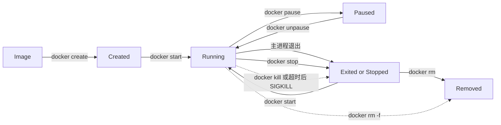

# Docker 容器生命周期

Docker 容器的运行状态由其主进程决定：创建容器不等于启动，主进程退出会使容器停止，停止也不等于删除。

## 核心要点

下面的图解决 `run`、`start`、`stop`、`kill` 和 `rm` 容易混淆的问题。实线表示常规状态转换，虚线表示强制或自动行为。

节点和箭头的含义：

- **Created**：容器配置和可写层已经创建，但主进程尚未启动。
- **Running**：容器主进程正在运行；容器内可以有子进程，但主进程是生命周期锚点。
- **Paused**：进程被冻结，容器没有退出。
- **Exited / Stopped**：主进程已经退出，容器元数据和可写层仍在。
- **Removed**：容器记录和可写层已删除，不能再 `start`；镜像通常仍存在。

关键结论：`docker run IMAGE` 每次都会创建一个新容器；`docker start NAME` 启动的是原来的停止容器。排查“为什么多了很多容器”时，应先确认是否反复使用了 `run`。

## 主进程与停止信号

容器主进程是容器启动时由 `ENTRYPOINT` 与 `CMD` 最终执行的第一个进程，它在容器自己的 PID namespace 中编号为 PID 1。它可能直接是 Java、Nginx 等服务进程，也可能是一个负责准备配置再启动服务的 Shell 入口脚本。这里的“主”表示它是容器的生命周期锚点，不一定表示容器中只能有这一个进程。

如果入口脚本以 `web-server &` 之类的方式启动服务，行尾的 `&` 由 Shell 解释：Shell 把服务作为后台子进程启动，并且不等待它结束。脚本没有其他命令后，作为 PID 1 的 Shell 就会退出；容器运行时据此把容器标记为 `Exited`，其余后台进程不能代替 PID 1 维持容器状态。

服务自身的“前台模式”与 Shell 的 `&` 是两个不同层次。例如，Nginx 的 `-g 'daemon off;'` 是 Nginx 参数，表示 Nginx 不要自行 daemon 化；`&` 却是 Shell 运算符，仍会把整条 Nginx 命令放到 Shell 后台。入口脚本通常应在最后执行 `exec nginx -g 'daemon off;'`：`exec` 用 Nginx 替换 Shell，使 Nginx 成为 PID 1；`daemon off;` 则保证 Nginx 不会再次转入后台。二者共同使容器生命周期和停止信号直接绑定到 Nginx。

宿主机上的 `docker run -d` 与容器内的 `command &` 含义不同：前者只是让 CLI 不占用当前终端，容器主进程仍正常运行；后者会让命令成为入口脚本的后台子进程，若 PID 1 脚本退出就会结束容器生命周期。

- 容器并不是必须长期运行；短任务完成后正常退出是预期行为。
- 容器主进程退出，无论退出码是否为 0，容器都会进入停止状态。
- `docker stop` 默认先向主进程发送镜像 `STOPSIGNAL` 指定的信号；未配置时通常是 `SIGTERM`。宽限期结束仍未退出，再发送 `SIGKILL`。
- `docker kill` 默认直接发送 `SIGKILL`，进程没有清理资源的机会，不应作为正常停止手段。
- Linux 中作为 PID 1 运行的进程有特殊信号语义；应用或入口脚本必须正确转发和处理终止信号。

## 停止、删除与自动删除

| 操作 | 容器是否存在 | 可否再次启动 | 容器可写层 | 镜像 |
| --- | --- | --- | --- | --- |
| `docker stop NAME` | 是 | 是 | 保留 | 保留 |
| 主进程自然退出 | 是 | 是 | 保留 | 保留 |
| `docker rm NAME` | 否 | 否 | 删除 | 保留 |
| `docker run --rm IMAGE` 退出 | 自动删除 | 否 | 自动删除 | 保留 |
| `docker rm -f NAME` | 强制删除 | 否 | 删除 | 保留 |

`--rm` 适合一次性、无需保留容器层和容器日志的任务；不适合需要停止后继续检查容器状态的学习步骤。命名 Volume 不会因为普通 `docker rm` 自动删除，但匿名 Volume 的行为受 `--rm`、`docker rm -v` 等选项影响，后续存储章节再展开。

## 主机关机与 Docker Desktop 退出

关闭终端不会停止后台容器，但退出 Docker Desktop 或关闭 Mac 会让本地 Daemon 不再可用。普通学习环境不要求在每次关机前全局停止所有容器；对于数据库、消息队列等有状态服务，推荐先用 `docker stop NAME` 或项目目录中的 `docker compose stop` 明确触发优雅停止，再正常关机。

不要把全局停止命令当成固定关机脚本：同一个 Engine 可能同时运行多个无关项目。Compose 项目应优先按项目管理；`docker compose stop` 保留容器供下次 `start`，`docker compose down` 会删除项目容器和网络，而 `down -v` 还会删除 Volume，可能造成持久化数据丢失。

## 与相邻概念的区别

- **停止与删除**：停止只结束进程；删除才移除容器对象。
- **`run` 与 `start`**：`run` 创建新容器再启动；`start` 启动已有容器。
- **`stop` 与 `kill`**：`stop` 给应用优雅退出机会；`kill` 默认强制终止。
- **`exec` 与 `run`**：`exec` 在现有运行中容器里启动额外进程；`run` 创建另一个容器。
- **退出码与容器存在性**：退出码描述主进程结果；容器是否被删除由 `rm` 或 `--rm` 决定。

## 前提与适用范围

重启策略、健康检查和编排器的自动恢复会影响“退出后是否再次运行”，但不会改变“容器主进程决定单次运行状态”这一基础模型。

参考：

- [docker container create](https://docs.docker.com/reference/cli/docker/container/create/)
- [docker container stop](https://docs.docker.com/reference/cli/docker/container/stop/)
- [docker container rm](https://docs.docker.com/reference/cli/docker/container/rm/)
- [Running containers](https://docs.docker.com/engine/containers/run/)
- [OCI Runtime and Lifecycle](https://github.com/opencontainers/runtime-spec/blob/main/runtime.md)

## 相关

- [[Docker镜像与容器]] — 生命周期操作作用在哪个对象上
- [[Docker架构]] — 谁接收并执行生命周期命令
- [[Docker环境验证与首个容器]] — 观察停止容器再次启动和删除
- [[01-Docker核心学习笔记]] — 第一阶段完整讲解
