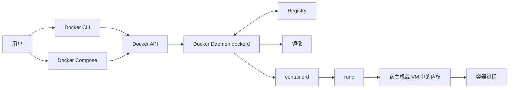

# Docker 架构

Docker 采用 Client–Server 架构：客户端通过 Docker API 向 Daemon 发出请求，Daemon 再协调镜像、容器、网络、存储和底层运行时。

## 核心要点

下面的图解决“输入一条 `docker` 命令后，究竟是谁在做事”的问题。按箭头从左向右阅读：用户先操作客户端，客户端调用 API，Daemon 负责管理对象并协调 Registry 与底层运行时。

节点和箭头的含义：

1. Docker CLI 与 Compose 都是客户端，不直接等同于 Daemon。
2. 客户端通过本地 Unix socket、命名管道或受保护的网络端点调用 Docker API。
3. `dockerd` 管理 Docker 对象；缺少镜像时，它通过 Registry 拉取清单和层。
4. Docker Engine 使用 `containerd` 管理容器生命周期，默认再由 `runc` 创建符合 OCI Runtime Specification 的进程环境。
5. 最终运行的是宿主机或 Docker Desktop Linux VM 内核上的进程。

关键结论：CLI 退出不代表容器停止；CLI 可以连接远程 Daemon；拥有 Docker API 的控制权通常等价于拥有极高的主机控制能力，不能把未保护的 Daemon socket 暴露给不可信用户。

## Docker Engine 与 Docker Desktop

| 对象 | 定位 | macOS / Windows | Linux |
| --- | --- | --- | --- |
| Docker Engine | 提供 API 并管理容器对象的核心引擎 | 通常由 Docker Desktop 提供并运行在 Linux VM 中 | 可直接安装，也可由 Docker Desktop 提供 |
| Docker Desktop | 桌面产品，集成 Engine、CLI、Compose、GUI 等 | 常见入门方案 | 可选；自身使用独立 VM 和 context |
| Docker CLI | 命令行客户端 | 连接 Desktop 中的 Engine，也可切换远程 context | 连接本地 Engine、Desktop Engine 或远程 Engine |
| Docker Daemon | Engine 的长期运行服务端进程 | 位于 Desktop 管理的环境中 | 通常是系统服务或 Rootless 用户服务 |

在 Linux 同时安装 Docker Engine 和 Docker Desktop 时，两者的镜像、容器和数据存储相互独立。判断当前连到哪个 Daemon，应检查 `docker context show` 与 `docker context ls`，不能只看 CLI 是否能执行。

在 macOS 上通过 Docker Desktop 使用本地容器时，Desktop 管理的 Linux VM 和 Engine 必须处于运行状态；Dashboard 窗口可以关闭，但退出 Docker Desktop 会停止这套本地 Engine。`docker run -d` 只让容器脱离当前终端，并不能让容器脱离 Daemon 独立运行。关闭终端不会停止后台容器，停止 Desktop/Daemon 则会影响其管理的全部本地容器。

## 与相邻概念的区别

- **CLI 与 Daemon**：CLI 负责表达意图，Daemon 负责执行；`docker` 命令存在不代表 Daemon 正常。
- **Engine 与 Desktop**：Engine 是核心容器引擎，Desktop 是包含 Engine 的桌面产品。
- **Registry 与 Repository**：Registry 是服务端系统；Repository 是其中按名称组织的一组镜像版本。
- **containerd 与 runc**：containerd 管理更长的生命周期；runc 聚焦按照 OCI 配置创建和运行单个容器。
- **Docker 与 OCI**：Docker 提供用户工作流；OCI 定义镜像、运行时与分发的互操作规范。

## 前提与适用范围

这张图是学习用主链路，省略了 BuildKit、网络驱动、存储驱动、shim 和平台专用组件。它足以解释常规 CLI 操作，但不应当作完整源码架构图。

参考：

- [What is Docker?](https://docs.docker.com/get-started/docker-overview/)
- [Alternative container runtimes](https://docs.docker.com/engine/daemon/alternative-runtimes/)
- [Docker Engine security](https://docs.docker.com/engine/security/)
- [Moby 项目](https://github.com/moby/moby)
- [OCI Runtime Specification](https://github.com/opencontainers/runtime-spec)

## 相关

- [[Docker]] — 平台和组件清单
- [[容器与虚拟机]] — 容器最终运行在哪种内核边界内
- [[Docker镜像与容器]] — Daemon 管理的核心对象
- [[Docker环境验证与首个容器]] — 用命令验证客户端、服务端和容器链路
