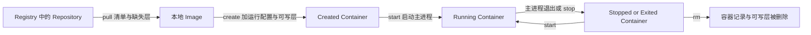

# Docker 镜像与容器

镜像（Image）是不可变、分层的应用包，容器（Container）是基于镜像和运行配置创建的可运行实例。

## 核心要点

| 对象 | 它保存什么 | 是否运行 | 典型命令 |
| --- | --- | --- | --- |
| Registry | 镜像清单、配置和层等内容 | 提供分发服务 | `docker pull`、`docker push` |
| Repository | 同一名称下的一组镜像引用 | 否 | `docker image ls` |
| Tag | 指向镜像内容的人类可读名称 | 否 | `nginx:1.29` |
| Digest | 由内容计算出的不可变标识 | 否 | `name@sha256:...` |
| Image | 只读层、配置和默认启动参数 | 否 | `docker image inspect` |
| Container | 镜像、运行配置、可写层和进程状态 | 可运行或停止 | `docker container inspect` |

镜像层记录文件系统的增加、修改和删除。多个镜像可以复用相同只读层；创建容器时，Docker 在镜像之上增加容器自己的可写层。删除容器时，未写入 Volume 或 Bind Mount 的容器层数据会随之丢失，但原镜像仍可保留。

## 从镜像到容器

下面的图解决“`docker run` 为什么有时先下载、之后又能直接启动”的问题。按从 Registry 到本地镜像，再到容器实例的顺序阅读。



节点和箭头的含义：

1. `docker pull` 只负责把镜像内容下载到本地，不创建容器。
2. `docker create` 根据镜像创建容器，但不启动主进程。
3. `docker start` 启动已有容器；`docker run` 是常用快捷流程，核心上包含 pull-if-needed、create 和 start。
4. 容器停止后仍然存在，可以检查、读取日志或再次启动。
5. `docker rm` 删除容器，不会自动删除它引用的镜像。

关键结论：同一个镜像可以创建多个彼此独立的容器；修改某个容器的可写层不会反向修改镜像，也不会自动影响其他容器。

## 镜像名称、Tag 与 Digest

完整镜像名的一般形式是：

```text
[REGISTRY_HOST[:PORT]/]NAMESPACE/REPOSITORY[:TAG]
```

- `nginx` 通常会被解析为 `docker.io/library/nginx:latest`。
- `latest` 只是省略 Tag 时使用的默认名称，不保证它是“语义上最新”“最安全”或“稳定版”。
- Tag 可以被重新指向新内容；Digest 由内容确定，用 Digest 拉取能固定到同一份内容。
- 固定 Digest 提高可复现性，但不会自动获得安全修复；更新仍需要显式选择新的 Digest。
- 多平台 Tag 通常指向 OCI Image Index，再根据 OS 和 CPU 架构选择具体平台镜像。

## 与相邻概念的区别

- **镜像与容器**：镜像像只读模板，容器像带运行配置和可写层的实例；但容器更准确地说是一组受隔离的进程及其上下文，而不是传统虚拟机。
- **Tag 与 Digest**：Tag 易读但可变；Digest 难读但不可变。
- **Repository 与 Registry**：Repository 是镜像名称空间中的集合；Registry 是承载和分发这些集合的服务。
- **Image ID 与 Registry Digest**：二者都使用内容摘要，但计算对象和展示语境不同，不应只凭短 ID 替代远端内容固定。
- **镜像层与容器可写层**：镜像层不可变且可复用；容器可写层属于单个容器，通常不应承担持久业务数据。

## 前提与适用范围

本页只建立对象模型。Dockerfile、构建缓存、多阶段构建、Volume 和 Bind Mount 会在后续阶段分别展开。

参考：

- [What is an image?](https://docs.docker.com/get-started/docker-concepts/the-basics/what-is-an-image/)
- [What is Docker?](https://docs.docker.com/get-started/docker-overview/)
- [docker image pull](https://docs.docker.com/reference/cli/docker/image/pull/)
- [OCI Image Configuration](https://github.com/opencontainers/image-spec/blob/main/config.md)
- [OCI Distribution Specification](https://github.com/opencontainers/distribution-spec)

## 相关

- [[Docker]] — Docker 平台入口
- [[Docker架构]] — 镜像和容器由谁管理
- [[Docker容器生命周期]] — 停止、启动与删除的精确区别
- [[Docker环境验证与首个容器]] — 用 `hello-world` 观察 pull、create、start 和 exit
