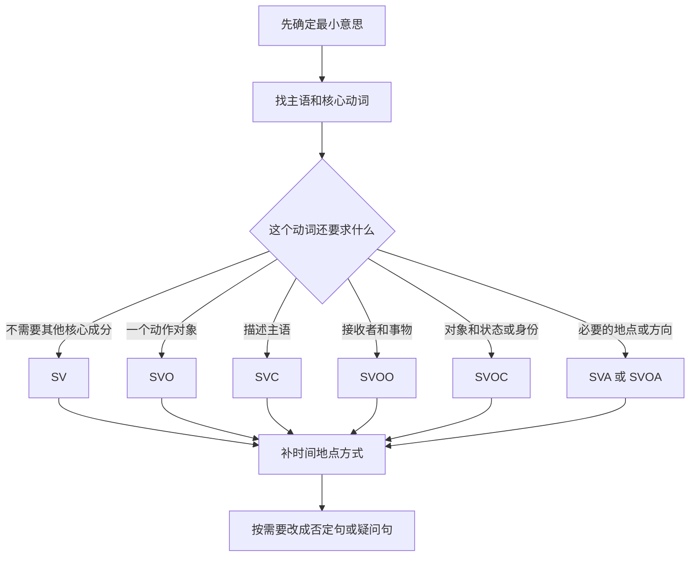

# 英语基本句型与口语造句

英语基本句型描述的是一个 clause（分句）由哪些核心成分组成；真正造句时应先选择核心动词，再按这个动词要求的成分填入主语、宾语、补语或必要的地点等信息。

## 核心要点

### 先认识五种成分

| 符号 | 英文 | 作用 | 示例中的成分 |
| --- | --- | --- | --- |
| `S` | subject | 主语：句子在说谁或什么 | `She` smiled. |
| `V` | verb | 谓语动词；可包含助动词 | She `is working`. |
| `O` | object | 宾语：动作涉及的人或事物 | I need `help`. |
| `C` | complement | 补语：说明主语或宾语是什么、怎么样 | She is `tired`. |
| `A` | adverbial | 状语：地点、时间、方式等 | He lives `in London`. |

句型不是先由中文含义机械决定的，而是由**要表达的关系和动词的 verb pattern**共同决定的。例如 `smile` 不需要宾语，`need` 通常需要宾语，`put` 在“放置”这个义项中通常同时需要宾语和地点。

### 传统五大基本句型

| 句型 | 适合表达 | 自然例句 | 判断方法 |
| --- | --- | --- | --- |
| `SV` | 谁做了什么；动作不需要对象 | `The baby is sleeping.` / `She smiled.` | 去掉时间、地点后，主语和动词已经完整 |
| `SVO` | 谁对什么做了什么 | `I need help.` / `She speaks English.` | 动词后需要一个动作对象 |
| `SVC` | 主语是什么或怎么样 | `I am tired.` / `The soup smells good.` | `C` 描述的就是 `S` |
| `SVOO` | 给谁、告诉谁或为谁准备什么 | `She gave me some advice.` | 间接宾语通常是接收者，直接宾语是事物 |
| `SVOC` | 使、认为、称呼某人或某物怎么样 | `The news made me nervous.` | `O` 与 `C` 可形成“宾语是/变得……”的关系 |

`SVC` 中的 `V` 不只有 `be`，还常见 `seem`、`become`、`feel`、`look`、`smell`、`sound`、`taste`、`get` 和 `stay`：

- `You look tired.`
- `The plan sounds good.`
- `He became a teacher.`

双宾语常能改写为 `直接宾语 + to/for + 接收者`：

- `She gave me a key.` → `She gave a key to me.`
- `He bought me coffee.` → `He bought coffee for me.`

但不是所有动词都允许双宾语。应说 `She explained the rule to me.`，不说 `She explained me the rule.`

### `There be` 是存在结构，不是传统第五句型

`There be` 用来首次引入某人或某物的存在、出现或位置：

- `There is a café near my office.`
- `There are two seats left.`
- `There was a problem yesterday.`

这里的 `there` 是 dummy subject（形式主语），不表示具体的“那里”。正式写作和考试中通常让 `be` 与后面的单复数一致；非正式口语中偶尔会听到 `There's two people outside.`，但学习者宜先使用规范形式 `There are two people outside.`

传统“五大基本句型”通常是 `SV / SVO / SVC / SVOO / SVOC`。把“做什么 → `SV/SVO`”合成一条，再把 `There be` 列为第五条，是一种方便记忆的口语口诀，不是唯一的语法分类法。

### 常见的七种 clause patterns

另一种常见教学法在五大句型之外补充 `SVA` 与 `SVOA`：

| 句型 | 作用 | 例句 |
| --- | --- | --- |
| `SVA` | 动词所表达的意义需要地点、时间或方向等信息 | `My parents live in Shanghai.` |
| `SVOA` | 动词同时需要宾语和地点、方向等信息 | `Please put your phone on the table.` |

`Please put your phone.` 不完整，因为 `put` 的“放置”义不仅要说明放什么，还要说明放到哪里。`I called you yesterday.` 中的 `yesterday` 则是可删除的附加信息，核心仍是 `SVO`。

> [!info] 分类边界
> 不同语法体系可能把某些地点成分标成 `A`，也可能标成必需的 `C`，所以“五种”或“七种”不是英语仅有的句子数量。对口语学习最重要的是判断某个动词还要求什么，而不是为每个句子争取唯一标签。

### 从意思到英语骨架

入口是自己真正想传达的最小信息，不是逐字翻译整句中文。先找“谁/什么”和最能承载意思的核心动词，再根据该动词的 verb pattern 选择分支：动作能独立完成用 `SV`，需要对象用 `SVO`，连接主语与身份或状态用 `SVC`，涉及接收者和事物用 `SVOO`，要说明宾语的身份或结果用 `SVOC`，而 `live/put` 等义项还可能要求地点或方向。骨架完整后，再补充时间、地点和方式；最后才借助 `be`、`do`、`have` 或情态动词改成否定句、一般疑问句或特殊疑问句。流程的输出是一个先求准确、再逐步扩展的口语句子。

### 口语中最实用的扩展

基本句型只说明单个分句的骨架。完整表达还常从其他维度扩展：

- 按交际功能分：陈述句、疑问句、祈使句、感叹句。
- 按分句数量分：简单句、并列句、复杂句。例如 `I was late because I missed the bus.` 是主句加原因从句。
- 无自然施事者时可用 dummy `it`：`It is important to practise every day.`、`It is raining.`
- 强调承受者时可用被动语态：`My phone was stolen.`
- 不确定完整说法时，先用高频框架包住较简单的内容：`I think...`、`I need...`、`I don't know if...`、`The problem is that...`

“这句话用英语怎么说？”可以说：

- `How do you say this in English?`
- `How can I say this naturally in English?`
- `I know what I mean, but I don't know how to say it in English.`

## 与相邻概念的区别

- **基本句型**描述一个分句需要哪些核心成分；**陈述、疑问、祈使、感叹**描述分句的交际功能。
- **简单句、并列句、复杂句**描述一句话包含多少个以及怎样连接分句，不是新的 `S/V/O/C/A` 骨架。
- **补语**完成动词或句子的必要意义；**可选状语**只是增加时间、地点、方式等背景。具体边界会随动词义项和语法体系变化。
- `There be` 引入某物的存在；`have` 表示某人拥有或经历某物：`There is a problem.` 与 `I have a problem.` 焦点不同。

## 前提与适用范围

句型是组织信息的脚手架，不能替代时态、冠词、介词、搭配和语境。练习口语时，先把最小骨架说对，再逐步扩展，比先在中文里造一个很长的句子再逐字翻译更可靠。

外部核查参考：[British Council：Clause structure and verb patterns](https://learnenglish.britishcouncil.org/free-resources/grammar/english-grammar-reference/clause-structure-verb-patterns)、[Cambridge：Clauses](https://dictionary.cambridge.org/grammar/british-grammar/clauses)、[Cambridge：Objects](https://dictionary.cambridge.org/grammar/british-grammar/objects)、[Cambridge：Complements](https://dictionary.cambridge.org/grammar/british-grammar/complements)、[Cambridge：There is, there's and there are](https://dictionary.cambridge.org/us/grammar/british-grammar/there-is-there-are)、[Cambridge：Clause types](https://dictionary.cambridge.org/grammar/british-grammar/clause)、[Cambridge：Sentences](https://dictionary.cambridge.org/grammar/british-grammar/sentences)。

## 相关

- [[英语学习笔记]] — 适合复习和口语操练的完整例句
- [[英语疑问感叹与倒装结构]] — 把基本陈述骨架改成疑问、感叹与倒装结构
- [[英语高频动词与短语动词]] — 核心动词如何决定宾语、补语和多词结构
- [[英语介词的空间模型]] — 句子扩展为地点、方向与时间信息时的介词选择
